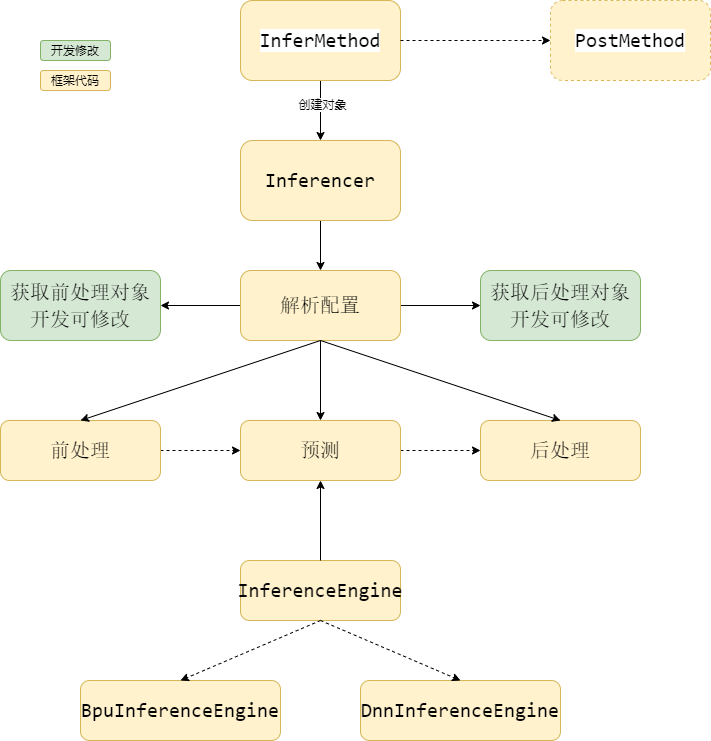
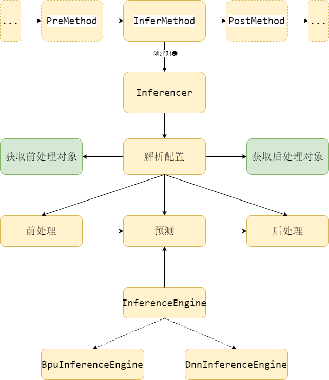

# 1 Introduce
model_inference预测组件用于集成推理模型，目的是降低模型集成到上板的复杂度。model_inference组件核心逻辑包括模型前处理、推理预测和后处理模块。组件内置了模型预测模块，用户只需要关注模型的前后处理模块，可以通过扩展前后处理的方式集成自定义的模型。
## 1.1 model_inference集成模型流程概述


如上图所示，使用model_inference集成一个模型，只需要两个步骤：准备模型信息、实现前后处理：
1. **准备模型信息**：
搜集相关模型信息形成配置，比如模型路径、模型后处理参数、模型前处理类型等
2. **前处理和后处理**：
框架定义了前后处理接口类，开发者继承接口实现前后处理派生类，框架也提供了常见的前后处理类，开发者可以直接复用

模型信息和前后处理准备完毕后，使用model_inference即可完成模型的集成，框架自动完成其他工作：
- 创建Task：
根据前述的模型信息创建一个Infer Task, Task包括前处理对象、后处理对象、模型信息、后处理参数等, 框架中由InferMethod完成
- 预测：
Task任务交给InfereEngine处理, Engine内部维持任务队列, 多线程执行Task，调用底层bpu相关接口完成模型预测任务

## 1.2 内部框架介绍
下图是ModelInference的整体框架，主要的模块如下：


- **Inferencer模块**:
  - 解析配置：获取模型路径、前后处理process对象、前后处理参数等
  - 执行预测：创建task并设置输入数据，执行前处理，task进队列
  - 执行后处理：等待预测任务处理完毕，然后调用后处理并输出结果
- **InferMethod**：
创建Inferencer对象，通过Inferencer创建task，执行前处理后把task交给InferenceEngine执行，执行结束后执行后处理，后处理的执行区分同步和异步两种模式
  - 同步：InferMethod中等待预测任务执行完成后执行后处理并输出结果
  - 异步：InfereMethod把task交给InferenceEngine后即返回，后处理由PostMethod处理
- **PostMethod**：配合InferMethod完成后处理相关功能
- **InferenceEngine**：执行具体BPU相关的预测操作，支持BPU和DNN两种接口，主要功能如下：
  - 加载模型，获取模型文件获取模型句柄
  - 获取模型输入/输出信息，比如数据类型、layout、
  - 申请输入/输出Tensor
  - 执行预测任务

# 2 编译与示例运行
## 2.1 依赖库说明
  1. 背景：框架依赖的库和头文件，都存放在host package压缩包中，它是随每次随统一发版包发布。例如ai_express_host_package-1.0.26.tar.gz。
  2. 使用方式：将ai_express_host_package-1.0.26.tar.gz解压后执行如下命令安装：
  ```shell
  cd host_package
  bash install_host_package.sh
  ```
  3. host_package内容包括:
    a) xstream动态库和头文件，提供AI模型集成形成workflow、任务调度等功能。
	  b) image_utils动态库和头文件，提供了c++接口版本的图像处理接口(软件处理)。
    c) bpu_predict动态库和头文件，提供模型预测的能力。
    d) dnn动态库和头文件，提供模型预测的能力。
  4. bpu_predict和dnn接口切换特殊说明
    目前支持两种接口实现预测功能，可以通过model_inference提供的接口修改，默认是dnn接口
    如果要切换成bpu_predict接口，对应的库也需要替换成bpu_predict的库，bpu_predict和dnn的依赖库目录如下：
    两者的lib下有同名的`libhbrt_bernoulli_aarch64.so`，使用不同接口需要拷贝对应的库，目前默认是dnn，如果切换到bpu_predict，则需要使用bpu_predict/lib下的`libhbrt_bernoulli_aarch64.so`。
```shell
├── bpu_predict
│   ├── include
│   │   ├── bpu_err_code.h
│   │   ├── bpu_parse_utils_extension.h
│   │   ├── bpu_predict_extension.h
│   │   └── bpu_version.h
│   └── lib
│       ├── libbpu_predict.a
│       ├── libbpu_predict.so
│       └── libhbrt_bernoulli_aarch64.so
├── dnn
│   ├── include
│   │   └── dnn
│   ├── lib
│   │   ├── libdnn.so
│   │   ├── libhbrt_bernoulli_aarch64.so
│   │   └── libopencv_world.so.3.4
```

## 2.2 代码目录说明
model_inference代码目录如下：
```shell
├── CMakeLists.txt
├── include
│   └── model_inference
│       ├── inference_data.h
│       ├── inference_engine_bpu.h
│       ├── inference_engine_dnn.h
│       ├── inference_engine.h
│       ├── inference_method.h
│       ├── inferencer.h
│       ├── inference_task.h
│       ├── postprocess
│       └── preprocess
├── src
│   ├── inference_engine_bpu.cc
│   ├── inference_engine.cc
│   ├── inference_engine_dnn.cc
│   ├── inferencer.cc
│   ├── postprocess
│   │   ├── age_gender_postprocess.cc
│   │   ├── faceid_postprocess.cc
│   │   ├── face_quality_postprocess.cc
│   │   ├── gesture_postprocess.cc
│   │   ├── horizon_multitask_postprocess.cc
│   │   ├── lmks3_postprocess.cc
│   │   ├── lmks4_postprocess.cc
│   │   ├── mobilenetv2_postprocess.cc
│   │   ├── plate_num_postprocess.cc
│   │   ├── utils
│   │   ├── vehicle_color_postprocess.cc
│   │   ├── vehicle_type_postprocess.cc
│   │   └── yolov3_postprocess.cc
│   ├── postprocess.cc
│   ├── preprocess
│   │   ├── faceid_preprocess.cc
│   │   ├── gesture_preprocess.cc
│   │   ├── image_preprocess.cc
│   │   ├── pyramid_preprocess.cc
│   │   ├── pyramid_roi_bpu_preprocess.cc
│   │   ├── pyramid_roi_preprocess.cc
│   │   ├── pyramid_roi_resizer_preprocess.cc
│   │   └── utils
│   └── preprocess.cc
├── make.sh
├── README.md
└── test
    ├── roi_task
    │   ├── CMakeLists.txt
    │   ├── configs
    │   ├── include
    │   ├── lib
    │   └── src
    └── tensor_task
        ├── CMakeLists.txt
        ├── configs
        └── sample.cc
```
  - inference_data: 定义公共数据结构
  - inference_engine_bpu: 实现bpu_predict预测相关功能
  - inference_engine_dnn: 实现dnn预测相关功能
  - inference_engine: 实现inference预测通用功能
  - inference_method: 实现InferMethod和PostMethod
  - inferencer: 执行预测、获取后处理结果等接口，配置解析也在此类中完成
  - inference_task: 定义task相关数据结构
  - postprocess: 后处理集合
  - preprocess: 前处理集合
  - test：sample用例
    - roi_task：年龄性别推理用例
    - tensor_task: yolov3检测用例

**说明**：更多model_inference使用示例请参考`ai_express_solution`

## 2.3 编译
```
bash make.sh
```
在model_inference目录下生成output文件夹，包含头文件和依赖库，该目录下有如下内容：
```shell
.
├── include
│   └── model_inference
│       ├── inference_data.h
│       ├── inference_engine_bpu.h
│       ├── inference_engine_dnn.h
│       ├── inference_engine.h
│       ├── inference_method.h
│       ├── inferencer.h
│       ├── inference_task.h
│       ├── postprocess
│       │   ├── age_gender_postprocess.h
│       │   ├── faceid_postprocess.h
│       │   ├── face_quality_postprocess.h
│       │   ├── gesture_postprocess.h
│       │   ├── horizon_multitask_postprocess.h
│       │   ├── lmks3_postprocess.h
│       │   ├── lmks4_postprocess.h
│       │   ├── vehicle_color_postprocess.h
│       │   ├── vehicle_type_postprocess.h
│       │   ├── plate_num_postprocess.h
│       │   ├── mobilenetv2_postprocess.h
│       │   └── yolov3_postprocess.h
│       │   ├── postprocess.h
│       │   ├── utils
│       │   │   └── gesture_postprocess_util.h
│       └── preprocess
│           ├── faceid_preprocess.h
│           ├── gesture_preprocess.h
│           ├── image_preprocess.h
│           ├── preprocess.h
│           ├── pyramid_preprocess.h
│           ├── pyramid_roi_bpu_preprocess.h
│           ├── pyramid_roi_preprocess.h
│           ├── pyramid_roi_resizer_preprocess.h
│           └── utils
│               ├── image_process.h
│               ├── lmks_process.h
│               └── roi_process.h
└── lib
    └── libmodel_inference.so
```
可拷贝此文件夹内容到第三方应用中使用

## 2.4 测试用例运行
编译后生成一个deploy文件夹，用于执行test中的用例，deploy包含以下内容：
```shell
.
├── lib
│   ├── libbpu_predict.so
│   ├── libdnn.so
│   ├── libhbrt_bernoulli_aarch64.so
│   ├── libimage_utils.so
│   ├── libmodel_inference.so
│   ├── libopencv_world.so.3.4
│   ├── libvideo_source.so
│   └── libxstream.so
├── roi_task
│   ├── configs
│   │   ├── age_gender_config.json
│   │   ├── faceAgeGender.hbm
│   │   ├── video_source
│   │   ├── x3_video_source.json.fb
│   │   ├── x3_video_source.json.mipi_cam
│   │   └── x3_video_source.json.usb_cam
│   └── roi_resizer_task
└── tensor_task
    ├── configs
    │   ├── 1080p.nv12
    │   ├── yolov3_config.json
    │   └── yolov3_nv12_hybrid_horizonrt.bin
    └── tensor_task
```
运行前设置环境变量：
```shell
export LD_LIBRARY_PATH=../lib:$LD_LIBRARY_PATH
```
1. roi_task运行命令(以回灌为例)：
```shell
cd deploy/roi_task
./roi_resizer_task ./configs/video_source/x3dev/feedback/x3_feedback_1080p_chn0.json ./configs/age_gender_co
nfig.json
```
2. tensor_task运行命令：
```shell
cd deploy/roi_task
./tensor_task ./configs/1080p.nv12 1080 1920
```

# 3 ModelInference实现原理
整体框架原理图如下所示：

框架包括：前处理、后处理、配置解析、预测Engine、method组件等模块。
- **前处理**：定义了前处理基类PreProcess，继承此类实现自己的前处理类，框架内部也实现了常用前处理类供开发者复用
- **后处理**：定义了后处理基类PostProcess，继承此类实现自己的后处理类，框架内部也实现了常用后处理类供开发者复用
- **Inferencer类**：配置解析由Inferencer类完成，解析获取前后处理对象、前处理pipline、后处理参数、预测参数等，生成task并调用前处理后，把task交给InferenceEngine执行具体预测任务
- **InferenceEngine**：预测引擎，目前支持bpu_predict和dnn两种接口，内部维持一个task队列，通过多线程方式高效执行预测任务
- **Method组件**：主要用于xstream串联Workflow


## 3.1 前处理
model_inference组件以配置为驱动，内置了部分通用前处理模块，典型配置如下：
```json
{
    "class_name": "pyramid_preprocess",
    "pyramid_layer": 4,
    "config": {
        "image_process_pipeline": [
            "pad(960, 960)",
            "resize(416, 416)"
        ],
        "roi_process_pipeline": [
                "norm_by_width_length(1.2, 0.91)"
        ]
    }
}
```
- **class_name**: 前处理类名称，根据此名称创建前处理对象，比如pyramid_preprocess、image_preprocess等
- **pyramid_layer**: 指定使用的金字塔层数
- **config**：指定前处理配置参数
  - image_process_pipeline: 对于image类型前处理指定此字段，内容为一个字符串数组，支持多个图像前处理pipeline
  - roi_process_pipeline：对于roi类前处理，设置此字段的前处理pipeline

### 3.1.1 前处理配置方法
1. 以`pyramid_preprocess`内置预处理为例，添加配置文件如下：

```json
{
    "class_name": "pyramid_preprocess",
    "pyramid_layer": 4,
    "config": {
        "image_process_pipeline": [
            "pad(960, 960)",
            "resize(416, 416)"
        ]
    }
}
```
输入金字塔图像pyramid，以上述配置文件为例，假设输入金字塔原图大小是1080p（1920x1080）。取金字塔第4层（960x540），padding到960x960，再resize到416x416大小。

2. 以`image_preprocess`内置预处理为例，添加配置文件如下：

```json
{
    "class_name": "image_preprocess",
    "config": {
        "image_process_pipeline": [
            "crop(0, 0, 959, 899)",
            "pad(960, 960)",
            "resize(416, 416)"
        ]
    }
}
```
输入RawData图像数据，以上述配置文件为例，假设输入图像大小是1080p（1920x1080）。裁剪图像感兴趣区域，左上角坐标(0,0)、右下角坐标(959, 899)，即得到960x900大小的图像，padding到960x960，再resize到416x416大小。


3. 以`pyramid_roi_preprocess`内置预处理的使用为例，添加配置如下：

```json
{
    "class_name": "pyramid_roi_preprocess",
    "config": {
        "roi_process_pipeline": ["norm_by_lside_length(1.2)"],
        "image_process_pipeline": [
            "resize(128, 128)"
        ]
    }
}
```
输入一系列检测框rois和金字塔图像pyramid，以上述配置文件为例，对检测框roi进行外扩系数为1.2的`norm_by_lside_length`的外扩处理后，取外扩后的norm_roi在金字塔原图对应的图像数据，并resize到128x128大小；上述预处理都是软件处理。


4. 以`pyramid_roi_bpu_preprocess`内置预处理为例，添加配置文件如下：

```json
{
    "class_name": "pyramid_roi_bpu_preprocess",
    "config": {
        "roi_process_pipeline": ["norm_by_lside_length(1.08)"]
    }
}
```
输入一系列检测框rois和金字塔图像pyramid，以上述配置文件为例，对检测框roi进行外扩系数为1.08的`norm_by_lside_length`的外扩处理后，crop外扩后的norm_roi在金字塔原图对应的图像数据，并resize到模型输入大小；上述crop&&resize的处理是硬件处理。

5. 以`pyramid_roi_resizer_preprocess`内置预处理为例，添加配置文件如下：

```json
{
    "class_name": "pyramid_roi_resizer_preprocess",
    "config": {
        "roi_process_pipeline": [
            "norm_by_lside_square(1.2, 0.91)"
        ]
    }
}
```
针对`resizer`输入方式的模型，输入一系列检测框rois和金字塔图像pyramid，以上述配置文件为例，对检测框roi进行外扩系数为1.2，宽高比为0.91的`norm_by_lside_square`的外扩处理，将处理后的norm_roi和金字塔封装为推理任务送入推理队列。

### 3.1.2 图像前处理pipeline类型
模型前处理部分，对于Image类型，包括如下功能：

 - pad(height, width):
 其中height和width为参数，默认采用对图像右下边进行padding，填充数据默认为0；目前仅支持nv12图像格式，且限制height和width参数需大于等于原始图像宽高，相关参数有如下限制：
    - pad目标宽、高需分别大于等于原始图像宽、高，且两者不能同时等于原始图像宽、高
    - pad的宽高、原始图像宽高，均须为偶数

 - resize(height, width)
 其中height和width为参数，默认对原始图像resize到参数大小，不保持宽高比；目前仅支持nv12图像格式，相关参数有如下限制：
    - 目标宽高不能等于原始图像宽高
    - 目标宽高必须为偶数

 - crop(x1, y1, x2, y2)
  其中x1,y1表示左上角坐标，x2,y2表示右下角坐标，默认裁剪原始图像的指定区域（包括左上角、右下角所在行列）；目前仅支持nv12图像格式，相关参数限制如下：
    - crop后的长宽必须为偶数
    - crop区域必须在原图内，不能出现超出原图边界的情况
    - crop区域参数正常，不能出现`x1 >= x2`或者`y1 >= y2`的情况

### 3.1.3 roi前处理pipeline类型
模型预处理部分，对于ROI类型，提供了集中不同类型的外扩方案，包括：
- norm_by_width_length
- norm_by_width_ratio
- norm_by_height_length
- norm_by_height_ratio
- norm_by_lside_length
- norm_by_lside_ratio
- norm_by_lside_square
- norm_by_diagonal_square
- norm_by_width_square
- norm_by_height_square
- norm_by_nothing
并可以在外扩方法后接参数(expand_scale, aspect_ratio)。

## 3.2 预测Engine
预测模块功能通过配置指定，包括：模型路径、模型packed属性以及该模型任务需要运行在哪个bpu核上；底层预测默认使用dnn接口。
```json
{
    "model_file_path": "./**.hbm",
    "is_packed_model": false,
    "model_name": "**",
    "run_mode": {
        "bpu_core": 1
    }
}
```

- **model_file_path**：指定模型文件路径
  - 相对路径：路径名称以非'/'开头，则表示相对配置文件的相对路径
  - 绝对路径：路径名称以'/'开头，则以绝对路径处理
- **is_packed_model**：表示输入模型是否重新打包过，bpu对于此模型加载有单独的方式
- **model_name**：指定模型名称，根据此名称获取具体模型句柄
- **run_mode**：指定此预测task的运行模式
  - **bpu_core**：
    - bpu_predict预测接口：0：由bpu选择在哪个core上运行；1：设置在bpu0上运行；2：设置在bpu1上运行
    - dnn预测接口：2：由bpu选择在哪个core上运行；0：设置在bpu0上运行；1：设置在bpu1上运行

Engine内部维护了task队列和线程池，可以高效处理队列中的预测任务。

## 3.3 后处理
后处理同前处理配置类似，需要指定`class_name`字段，以使用对应的后处理方法。
```json
{
  "model_post_process": {
        "class_name": "age_gender_postprocess"
    }
}

```
框架初始化时根据此字段创建对应对象
此外，还可以配置后处理的参数，框架把此json统一传给后处理对象，参数用在模型后处理中，比如yolov3的后处理配置如下：
```json
{
  "model_post_process": {
        "class_name": "yolov3_postprocess",
        "score_threshold": 0.3,
        "nms_threshold": 0.45,
        "nms_top_k": 500,
        "basic_pyramid_image_height": 540,
        "basic_pyramid_image_width": 960,
        "src_image_height": 1080,
        "src_image_width": 1920
    }
}
```

## 3.4 model_inference其他配置参数
 1. 组件中默认预测和后处理过程是同步，即在InferMethod中输出后处理的结果；若用户想将预测后处理过程pipeline起来，需要配置`with_postprocess`字段为false，表示InferMethod中不做后处理，这种情况下，InferMethod有两个输出：该帧的"infer"对象和"tasks"推理任务。
 **注意**："with_postprocess"的配置需要和workflow中的Method对应，当`with_postprocess`字段为false，InferMethod需要与PostMethod串联；否则不需要。

 2. 组件中默认对模型输出的BPU结果进行转浮点操作；若用户不需要将定点模型输出结果转浮点，则需要配置`convert_to_float`字段为false，表示不对BPU输出结果转换。
 **注意**：配置"convert_to_float"=false后，后处理直接处理BPU输出结果后，需要将BPU内存释放。

```json
{
    "with_postprocess": false,
    "convert_to_float": false
}
```

## 3.5 method组件
model_inference组件内部扩展了`InferMethod`和`PostMethod`以支持在xstream中使用。用户可以在xstream的workflow中配置两个method使用预测组件。

以多任务检测+年龄性别识别任务为例，workflow需要串联多任务检测和年龄性别识别两个模型。workflow配置如下：
```json
{
  "inputs": [
    "image"
  ],
  "outputs": [
    "image",
    "face_box",
    "head_box",
    "body_box",
    "pose",
    "lmk",
    "kps",
    "age",
    "gender"
  ],
  "workflow": [
    {
      "method_type": "InferMethod",
      "unique_name": "multi_task",
      "inputs": [
        "image"
      ],
      "outputs": [
        "body_box",
        "head_box",
        "face_box",
        "lmk",
        "pose",
        "kps"
      ],
      "method_config_file": "infer_multitask_config.json"
    },
    {
      "method_type": "InferMethod",
      "unique_name": "age_gender_infer",
      "inputs": [
        "face_final_box",
        "image"
      ],
      "outputs": [
        "age_gender_infer",
        "age_gender_task"
      ],
      "method_config_file": "infer_age_gender.json"
    },
    {
      "method_type": "PostMethod",
      "unique_name": "age_gender_post",
      "inputs": [
        "age_gender_infer",
        "age_gender_task"
      ],
      "outputs": [
        "age",
        "gender"
      ],
      "method_config_file": ""
    }
  ]
}
```

对应的多任务检测配置infer_multitask_config.json，配置"convert_to_float"为false，"with_postprocess"为true，即不对BPU结果转换浮点，并在InferMethod中进行后处理操作，输出智能结果。
```json
{
    "with_postprocess": true,
    "convert_to_float": false,
    "model_preprocess":{
        "class_name": "pyramid_preprocess",
        "pyramid_layer": 4,
        "config": {
            "image_process_pipeline": [
            ]
        }
    },
    "model_predict": {
        "model_file_path": "../../models/personMultitask.hbm",
        "is_packed_model": false,
        "model_name": "personMultitask",
        "run_mode": {
            "bpu_core": 2
        }
    },
    "model_post_process": {
        "class_name": "horizon_multitask_postprocess",
        "net_info": {
            "model_name": "personMultitask",
            "model_version": "0.0.27",
            "model_out_sequence": [
              {
                "name": "body_box_int",
                "type": "invalid"
              },
              {
                "name": "body_box",
                "type": "bbox"
              },
              {
                "name": "head_box_int",
                "type": "invalid"
              },
              {
                "name": "head_box",
                "type": "bbox"
              },
              {
                "name": "face_box_int",
                "type": "invalid"
              },
              {
                "name": "face_box",
                "type": "bbox"
              },
              {
                "name": "lmks2_label",
                "type": "lmks2_label",
                "box_name": "face_box"
              },
              {
                "name": "lmks2_offset",
                "type": "lmks2_offset"
              },
              {
                "name": "pose",
                "type": "3d_pose",
                "box_name": "face_box"
              },
              {
                "name": "lmks1_label",
                "type": "lmks1",
                "box_name": "face_box"
              },
              {
                "name": "kps_label",
                "type": "kps_label",
                "box_name": "body_box"
              },
              {
                "name": "kps_offset",
                "type": "kps_offset"
              }
            ],
            "model_input_width": 960,
            "model_input_height": 540,
            "src_image_width": 1920,
            "src_image_height": 1080,
            "pyramid_layer": 4,
            "kps_pos_distance": 25,
            "kps_feat_width": 16,
            "kps_feat_height": 16,
            "kps_points_number": 17,
            "lmk_feat_width": 8,
            "lmk_feat_height": 8,
            "lmk_points_number": 5,
            "lmk_pos_distance": 12,
            "lmk_feat_stride": 16,
            "3d_pose_number": 3
          },
        "method_outs": ["body_box", "head_box", "face_box", "landmark", "pose", "kps"]
    }
}
```

对应的年龄性别识别配置infer_age_gender.json，配置"with_postprocess"为false，默认"convert_to_float"为true，即不在InferMethod中进行后处理操作，InferMethod输出中间结果。注意"with_postprocess"的设置需要与workflow配置的method对应。
```json
{
    "with_postprocess": false,
    "model_preprocess":{
        "class_name": "pyramid_roi_resizer_preprocess",
        "config": {
            "roi_process_pipeline": [
                "norm_by_nothing"
            ]
        }
    },
    "model_predict": {
        "model_file_path": "../../models/faceAgeGender.hbm",
        "is_packed_model": false,
        "model_name": "faceAgeGender",
        "run_mode": {
            "bpu_core":1
        }
    },
    "model_post_process": {
        "class_name": "age_gender_postprocess"
    }
}
```

# 4 开发示例
以test中的tensor_task为例
## 4.1 准备配置参数：
1. **mode**: 设置为`run_model`或`run_model_with_box`即可，只是显示预测类型，实际不影响程序功能
2. **with_postprocess**: 设置为false，InferMethod把预测输出交给PostMethod完成后处理
3. **model_preprocess**: 指定前处理配置信息
    - class_name: 指定前处理对象为image_preprocess
    - pyramid_layoer: 用于金字塔数据获取，设置为第四层
    - config: 指定前处理pipeline, 根据模型需要进行配置, 先resize后pad再resize
4. **model_predict**: 指定预测配置信息，包括模型路径、模型名称、模型运行在哪个core上
5. **model_post_process**: 指定后处理参数，和模型强相关，用于模型后处理
详细配置参数如下：
```json
{
    "mode": "run_model",
    "with_postprocess": false,
    "model_preprocess":{
        "class_name": "image_preprocess",
        "pyramid_layer": 4,
        "config": {
            "image_process_pipeline": [
                "resize(540, 960)",
                "pad(960, 960)",
                "resize(416, 416)"
            ]
        }
    },
    "model_predict": {
        "model_file_path": "./yolov3_nv12_hybrid_horizonrt.bin",
        "is_packed_model": false,
        "model_name": "Darkent2Caffe_hybrid",
        "run_mode": {
            "bpu_core":0,
            "thread_num": 1
        }
    },
    "model_post_process": {
        "class_name": "yolov3_postprocess",
        "score_threshold": 0.3,
        "nms_threshold": 0.45,
        "nms_top_k": 500,
        "basic_pyramid_image_height": 540,
        "basic_pyramid_image_width": 960,
        "src_image_height": 1080,
        "src_image_width": 1920
    }
}
```

## 4.2 准备前后处理
这里使用框架中提供的前后处理，如配置文件中所示
- **前处理**：使用image_preprocess，对应框架中ImageInputWithPreProcess类
- **后处理**：使用yolov3_postprocess，对用框架中YoloV3PostProcess类
这里直接复用了框架中的前后处理processer，对于不能复用的模型，需要继承PreProcess和PostProcess实现自己的派生类，并在配置中指定新前后处理processer类。

## 4.3 main函数代码：
1. 声明infer_method用于执行预测操作，其输入配置为4.1中准备的json文件
2. 读取nv12图片，设置图片长宽，用于填充input输入数据，output用于接收后处理的输出
3. infer_method.DoProcess(input, param) 用于执行具体前处理、预测、后处理
4. post_method对象用来做后处理，以infer_method.DoProcess的输出output作为post_method的输入
```c++
int main(int argc, char* argv[]) {
  if (argc < 4) {
    std::cout << "exec image_path img_height img_width";
    return -1;
  }
  SetLogLevel(HOBOT_LOG_DEBUG);
  inference::InferenceEngine::SetPredictType(inference::DNN_PREDICT);

  int ret = 0;

  inference::InferMethod infer_method;
  ret = infer_method.Init("./configs/yolov3_config.json");
  if (ret != 0) {
    LOGE << "InferMethod Init failed";
    return -1;
  }

  std::vector<xstream::BaseDataPtr> input;
  std::vector<xstream::BaseDataPtr> output;
  xstream::InputParamPtr param;
  // 构建input
  std::shared_ptr<xstream::RawDataImageFrame> image =
      std::make_shared<xstream::RawDataImageFrame>();
  {
    image->pixel_format_ = xstream::kHorizonVisionPixelFormatRawNV12;
    image->frame_id_ = 0;

    std::ifstream ifs(argv[1],
                      std::ios::in | std::ios::binary);
    if (!ifs) {
      HOBOT_CHECK(0) << "Open image file: " << argv[1] << " failed";
    }
    ifs.seekg(0, std::ios::end);
    int img_length = ifs.tellg();
    ifs.seekg(0, std::ios::beg);
    char *img_bin = new char[sizeof(char) * img_length];
    ifs.read(img_bin, img_length);
    ifs.close();

    image->data_ = reinterpret_cast<uint8_t*>(img_bin);
    image->height_ = atoi(argv[2]);
    image->width_ = atoi(argv[3]);
  }
  input.push_back(image);

  output = infer_method.DoProcess(input, param);

  inference::PostMethod post_method;
  post_method.DoProcess(output, param);

  return 0;
}
```
## 4.4 运行结果如下：
```c++
export LD_LIBRARY_PATH=../lib:$LD_LIBRARY_PATH
./tensor_task ./configs/1080p.nv12 1080 1920
(inferencer.cc:29): Inferencer config path: ./configs/yolov3_config.json
(inferencer.cc:30): Inferencer config parent path: ./configs/
(inference_engine.cc:126): InferenceTaskLoop: 0
(inference_engine.cc:126): InferenceTaskLoop: 1
(inference_engine.cc:126): InferenceTaskLoop: 0
(inference_engine.cc:126): InferenceTaskLoop: 1
(inference_engine.cc:126): InferenceTaskLoop: 2
(inference_engine.cc:126): InferenceTaskLoop: 2
[HBRT] set log level as 0. version = 3.13.4
[BPU_PLAT]BPU Platform Version(1.3.0)!
[HorizonRT] The model builder version = 1.1.35
(inference_engine_dnn.cc:27): hbDNNInitializeFromFiles, ./configs/./yolov3_nv12_hybrid_horizonrt.bin, ret = 0
(inference_engine_dnn.cc:35): modelName = Darkent2Caffe_hybrid
(inference_engine_dnn.cc:84): found model: Darkent2Caffe_hybrid
(inference_method.h:51): InferMethod DoProcess Start
(image_process.cc:322): Start ImageProcess Execute...
(image_preprocess.cc:67): preprocess success
(inference_engine_dnn.cc:235): output tensor len = 172384
(inference_engine_dnn.cc:242): mem tensor len = 172384
(inference_engine_dnn.cc:235): output tensor len = 689520
(inference_engine_dnn.cc:242): mem tensor len = 689520
(inference_engine_dnn.cc:235): output tensor len = 2758080
(inference_engine_dnn.cc:242): mem tensor len = 2758080
(inferencer.cc:151): core_id: 0
(inference_engine_dnn.cc:394): input_layer: 1
(inference_engine_dnn.cc:395): output_layer: 3
(inference_engine_dnn.cc:546): run model end, ret: 0
(inference_engine.cc:225): task ret: 0
(yolov3_postprocess.cc:92): YoloV3PostProcess Execute
(yolov3_postprocess.cc:230): ( x1: 1212.98 y1: 57.6426 x2: 1865.26 y2: 1078 score: 0.995713 ), id: 0, category_name: person
(yolov3_postprocess.cc:230): ( x1: 661.58 y1: 34.3084 x2: 1324.98 y2: 1078 score: 0.987776 ), id: 0, category_name: person
(yolov3_postprocess.cc:230): ( x1: 82.9275 y1: 84.8354 x2: 701.428 y2: 1069.15 score: 0.959816 ), id: 0, category_name: person
(yolov3_postprocess.cc:230): ( x1: 1446.5 y1: 439.404 x2: 1690.53 y2: 853.147 score: 0.322479 ), id: 27, category_name: tie

```
# 5 框架支持的前后处理
## 5.1 目前支持的前处理
 1) **pyramid_roi_resizer_preprocess**
 面向`resizer`的输入方式的模型，输入数据为一系列检测框rois和金字塔图像pyramid。预测时底层会依赖硬件resizer模块。

 2) **pyramid_preprocess**
 面向`pyramid`输入方式的定点模型，输入数据是金字塔图像pyramid。该处理中取金字塔配置的层，送入模型进行推理。

 3) **pyramid_roi_bpu_preprocess**
 面向`pyramid`输入方式的模型，输入数据是一系列检测框rois和金字塔图像pyramid，与前处理2)`pyramid_preprocess`不同的是，该处理中取金字塔原图对应的roi图像数据，经过硬件crop&resize到模型输入大小，送入模型进行推理。

 4) **pyramid_roi_preprocess**
 面向`pyramid`输入方式的模型，输入数据是一系列检测框rois和金字塔图像pyramid，与前处理3)`pyramid_roi_bpu_preprocess`不同的是，该处理中取金字塔原图对应的roi图像数据，经过软件的图像处理操作送入模型进行推理。

 5) **image_preprocess**
 输入数据是nv12格式的`RawDataImageFrame`数据。该处理中取输入图像并按配置进行一系列图像处理后送入模型进行推理。

 6) **faceid_preprocess**
 针对"人脸特征提取"模型的预处理，输入数据是`SnapshotInfo`。

 7) **gesture_preprocess**
 针对"手势识别"模型的预处理。


## 5.2 目前支持的后处理
 1) **age_gender_postprocess**
 针对"年龄性别"模型的后处理，输出年龄、性别结果

 2) **face_quality_postprocess**
 针对"人脸质量"模型的后处理，输出14个人脸质量相关的结果。

 3) **faceid_postprocess**
针对"人脸特征提取"模型的后处理，输出128维人脸特征数据。

 4) **horizon_multitask_postprocess**
 针对"多任务检测"模型的后处理，内置后处理包括检测框、人体骨骼点、分割等。

 5) **lmks3_postprocess**
 针对"手关键点"模型的后处理，输出手关键点。

 6) **lmks4_postprocess**
 针对"人脸关键点"模型的后处理，输出人脸关键点。

 7) **plate_num_postprocess**
 针对"车牌号"识别模型的后处理，输出车牌号。

 8) **vehicle_color_postprocess**
 针对"车辆颜色"模型的后处理，输出车辆颜色。

 9) **vehicle_type_postprocess**
 针对"车辆类型"模型的后处理，输出车辆类型。

 10) **yolov3_postprocess**
 针对开源模型"yolov3"的后处理，输出检测框。

 11) **mobilenetv2_postprocess**
 针对开源模型"mobilenetv2"的后处理，输出类别。

 12) **gesture_postprocess**
 针对"手势识别"模型的后处理，输出手势类别。


# 6 如何扩展自定义模型
首先用户需要了解需要扩展自定义模型的前后处理，以及编译模型时的输入方式。

若模型编译为`resizer`方式，则预测任务类型是`RoiInferenceEngineTask`，否则任务类型是`TensorInferenceEngineTask`。

## 6.1 扩展预处理
预处理中的主要操作：
1) 获取模型输入输出维度大小、数据类型、排布等属性；
2) 根据模型类型创建对应的预测任务；
3) 解析输入数据，根据需要申请BPU输入、输出内存空间，并将输入数据复制到对应的BPU输入中；
4) 返回task预测任务

扩展CustomPreProcess，并实现`Execute`函数，即实现上述主要操作。
```c++
class CustomPreProcess : public PreProcess {
 public:
  explicit CustomPreProcess(Inferencer* infer) : PreProcess(infer) {}
  virtual ~CustomPreProcess() {}

  virtual int Init(const std::string &json_str);

  virtual int Execute(const std::vector<xstream::BaseDataPtr> &input,
                      std::vector<std::shared_ptr<InferenceEngineTask>>& tasks);
};
```

在`PreProcess::GetInstance()`中注册对应的自定义预处理。
```c++
std::shared_ptr<PreProcess> PreProcess::GetInstance(
    std::string class_name, Inferencer* infer) {
  if (class_name == "custom_preprocess") {
    return std::make_shared<CustomPreProcess>(infer);
  } else {
    return nullptr;
  }
}
```

设置配置文件：
```json
{
    "class_name": "custom_preprocess",
    "config": {
    }
}
```

## 6.2 扩展后处理
后处理中的主要操作获取预测任务，取输出结果，进行解析。需要注意的是，若扩展的后处理不需要转浮点操作，则需要在解析完成后，自行将BPU输出内存释放。

扩展CustomPostProcess，并实现`Execute`函数，即实现上述主要操作。
```c++
class CustomPostProcess : public PostProcess {
 public:
  virtual int Init(const std::string &json_str);

  virtual int Execute(
      const std::vector<std::shared_ptr<InferenceEngineTask>> &tasks,
      std::vector<xstream::BaseDataPtr> *frame_result);
};
```

在`PostProcess::GetInstance()`中注册对应的自定义预处理。
```c++
std::shared_ptr<PostProcess> PostProcess::GetInstance(std::string class_name) {
  if (class_name == "custom_postprocess") {
    return std::make_shared<CustomPostProcess>();
  } else {
    return nullptr;
  }
}
```

设置配置文件：
```json
{
    "class_name": "custom_postprocess",
    "xx": "xx"
}
```