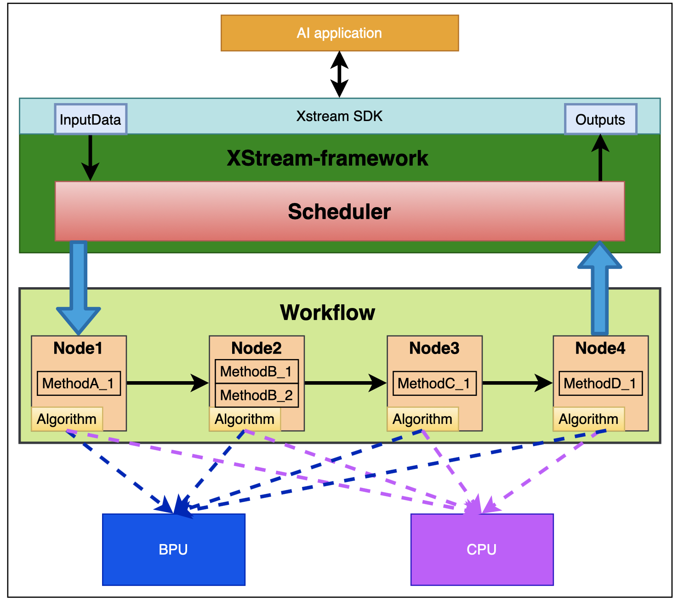
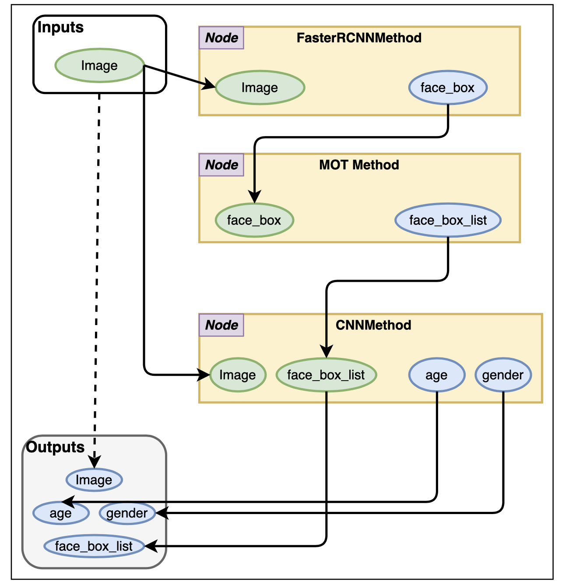
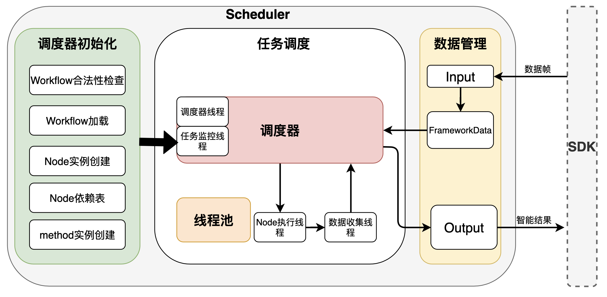
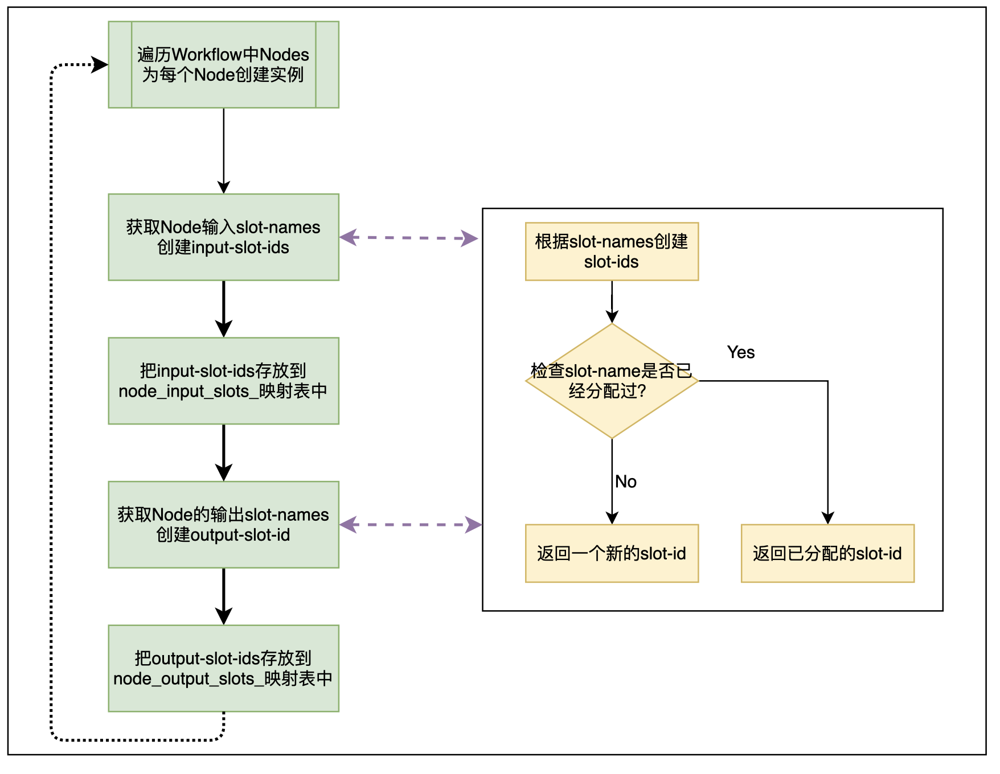
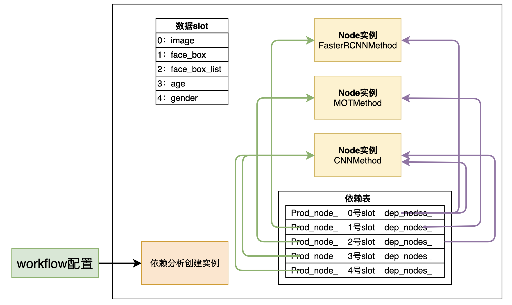
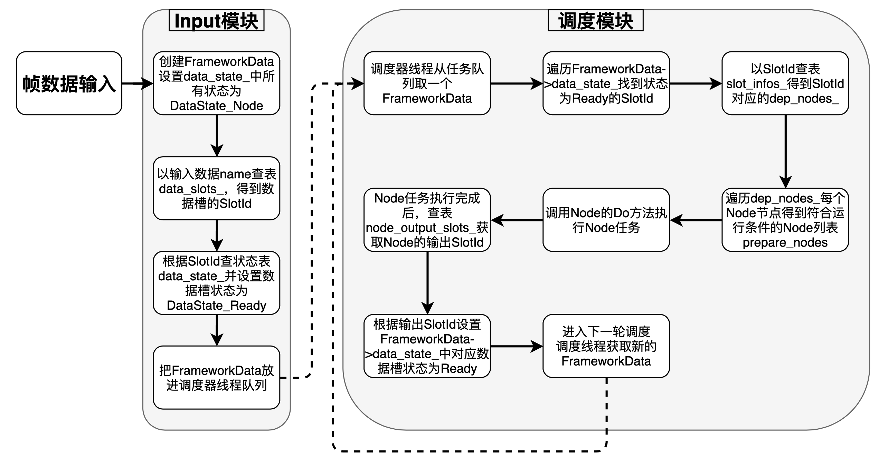

# XStream算法SDK开发框架

XStream Framework是一个多线程调度框架，主要用于多模型串联，多策略模块串联的场景。XStream内部采用节点来表现一个线程级的执行模块，多个执行模块基于数据驱动来构建一个有向图，内置有向图调度以及多线程调度能力，基于JSON配置文件快速完成有向图的构建，并最大化地利用CPU或者其他硬件资源来实现执行模块的最大并行度地pipeline运行。

```
XStream和BPU Predict的关系：
1. BPU Predict是属于地平线模型执行的Runtime SDK开发库，以模型为维度，支持将一个编译后的算法模型部署到地平线BPU芯片上，并提供了推理接口，内存分配等接口，支持用户完成对一次数据的推理预测。
2. XStream本身定位是一个多线程调度框架，内部执行的节点可以是一个模型的推理计算或策略计算，它主要是解决的多模型集成和执行加速问题。
对于将模型推理集成到XStream中当前还需要用户自己去撰写源代码，当前我们也在做XStream框架内内置快速模型集成能力的开发，简化模型集成和开发流程，预计2021年Q2版本发布。
```

XStream服务模型和策略集成，它有如下特性：

1. 框架内置高性能的多线程调度框架，可以实现多模型、多策略的并发调度。
2. 提供标准Method接口，支持业务基于Method进行标准业务逻辑封装，从而实现算法能力的积累和复用。
3. 基于JSON配置文件来实现Workflow搭建，可以根据业务需求快速调整业务数据流。
4. 与XProto Framework融合，支持快速将一个算法SDK转换为应用Application。

## 1. 使用和编译
XStream Frameowork采用**预编译库**和**源代码**两种方式进行发布。通常情况下，用户仅仅需要引用预编译库的include头文件和so/a库就可以进行应用开发。仅仅在一些二次开发场景，用户才需要源代码进行修改和编译。

```
XStream源代码在Github社区进行开源(https://github.com/HorizonRobotics-Platform/AI-EXPRESS)，如果你对XStream框架本身有好的想法需要进行二次开发，也欢迎您在社区上和我们进行讨论，并贡献您的代码。
```
预编译库目标发布包括Release和Debug版本的动态库和静态库文件，你可以根据的需求自主引用相应的库文件。发布包目录结构如下所示。

```
└── xstream
    ├── include
    │   └── xstream
    ├── centos
    ├── ubuntu
    └── xj3j5
```

源代码编译这块，目前我们采用CMake来管理框架的工程编译（CMake版本要求2.8+）。在源码根目录下，我们默认提供了XJ3 Aarch64，J5 Aarch64、Centos/Ubuntu X86三个平台的编译Shell脚本，支持你可以进行编译。

```shell
bash build_aarch64.sh
bash build_centos.sh
bash build_ubuntu.sh
```

对于arm aarch64环境，需要提前配置交叉编译环境。

```
// xj3j5交叉编译环境如下：
set(CMAKE_CXX_COMPILER /opt/gcc-linaro-6.5.0-2018.12-x86_64_aarch64-linux-gnu/bin/aarch64-linux-gnu-g++)
```


## 2. 开发示例：Hello World
本章节我们将采用一个简单数值计算示例，来解释如何在基于XStream进行算法SDK开发的全流程。

基于XStream Framework进行算法/策略计算，主要包括以下三个内容：

1. **Method开发**：XStream框架提供了多Method的串联能力，Method是一种AI/策略的能力封装，在XStream框架中，它表现为一个类。
2. **Workflow构建**：通过一个JSON配置，基于INPUT/OUTPUT的依赖关系，将多个Method进行串联，构建一个计算图，这个用JSON配置文件表示的计算图即为Workflow。
3. **SDK加载和执行**：构建XStream运行环境，加载Workflow配置文件，在内存中构建出每个Method对象和线程池，基于XStream提供的接口实现对Workflow的推理和运行。

下面示例功能描述如下：定义平均值计算AverageMethod和最大值计算MaxMethod，并将其组织为一个Workflow，通过XStream SDK接口来实现Workflow的加载和执行，完成对输入数据的平均值和最大值的计算。

### 2.1 Method开发
Method作为一个计算载体，它和普通函数一样，包括输入，计算和输出，为了实现跨Method之间的级连计算，那么需要定义一个标准的数据结构，从而可以被多个Method进行识别和处理。

#### 1. 定义数据类型
在本示例中，我们定义了FloatArray与FloatValue，分别表示float数组以及单个float值，它们均继承自BaseData
```C++
struct FloatArray : public BaseData {
  std::vector<float> float_array_;
}

struct FloatValue : public BaseData {
  FloatValue() {}
  FloatValue(float x) {
    value_ = x;
  }
  float value_ = 0;
};
```

**注意**：针对通用的视觉处理场景，我们在XStream框架中内置了基础VisonType，其中包括了常见的图像帧，Point点，BBOX框等基础视觉数据结构的表示。地平线内部各个产品线也是基于该数据结构进行扩展。也建议你尽量复用这些数据结构进行你的Method开发，从而实现你的Method可以与地平线开放的各个Method进行级连。详细参见```include/vison_type.h```头文件。

#### 2. 定义Method
在XStream Framework里面，每个Method被定义为一个类型，通过继承框架内的基础类SimpleMethod进行实现，用户需要自主实现```Init，DoProcess```等函数来实现Method生命周期管理以及Method的执行体的逻辑实现。

下面是平均值计算AverageMethod和最大值计算MaxMethod两个参考示例的实现：
```C++
// 平均值计算
class AverageMethod : public SimpleMethod {
 public:
  int Init(const std::string &config_file_path) {
    return 0;
  }

  std::vector<BaseDataPtr> DoProcess(
      const std::vector<BaseDataPtr> &input,
      const xstream::InputParamPtr &param) override {
    // 强制对输入类型进行检查和转换
    // 每个method实现都是面向特定数据类型；
    assert (input.size == 1);  
    auto in_datas = std::static_pointer_cast<FloatArray>(input[0]);

    // 计算逻辑的实现
    float sum = 0;
    for (auto &one_float : in_datas->float_array_) {
      sum += one_float;
    }
    float avg = sum / in_datas->float_array_.size();

    // 输出结果的组装并直接返回
    // 返回的数据可以被框架传递给下一个Method进行处理
    auto float_value = std::make_shared<FloatValue>(avg);
    std::vector<BaseDataPtr> output;
    output.push_back(float_value);  // 输出也只有一个值
    return output;
  };
};

// 最大值计算
class MaxMethod : public SimpleMethod {
 public:
  int Init(const std::string &config_file_path) {
    return 0;
  }

  std::vector<BaseDataPtr> DoProcess(
      const std::vector<BaseDataPtr> &input,
      const xstream::InputParamPtr &param) override {
    // 强制对输入类型进行检查和转换
    // 每个method实现都是面向特定数据类型；
    assert (input.size == 1);  
    auto in_datas = std::static_pointer_cast<FloatArray>(input[0]);

    // 计算逻辑的实现
    float max_value = in_datas->float_array_[0];
    for (int i = 1; i < in_datas->float_array_.size(); ++i) {
      if (max_value < in_datas->float_array_[i]) {
        max_value = in_datas->float_array_[i];
      }
    }

    // 输出结果的组装并直接返回
    // 返回的数据可以被框架传递给下一个Method进行处理
    auto float_value = std::make_shared<FloatValue>(avg);
    std::vector<BaseDataPtr> output;
    output.push_back(max_value);  // 输出也只有一个值
    return output;
  };
};
```
在Method的实现时，SimpleMethod::Init和SimpleMethod::DoProcess两个关键函数需要用户自主进行实现。
1. SimpleMethod::Init是通过一个配置文件来对Method进行配置，在Workflow的构建时候，可以通过该每个Method的配置文件来实现对method的功能定制化。在本示例中，我们没有对齐进行配置，在一些模型推理的Method中，该配置文件内容会比较多，比如method一些输入尺寸等配置信息。
2. SimpleMethod::DoProcess属于Method的计算体，其中input输入参数表示为vector数组，它用来表示一次计算多个输入字段，每个字段都是BaseData类型或者其派生类，都有明确的数据类型，在Workflow配置中，它对应了Method的INPUT字段；param输入参数表示本次计算运行参数信息，大部分场景用不到，可以不关注。DoProcess函数return信息也是一个vector数组，每个字段都是BaseData类型或者其派生类，都有明确的数据类型，在Workflow配置中，它对应了Method的OUTPUT字段。

```
在XStream Framework里面，我们倡导是Method的高度复用性，它作为一种载体来实现算法能力和算法策略跨场景复用。
因此我们倡议，在Method的实现时候，尽量实现逻辑抽象提供复用性，并提供配套的文档，描述清楚Method的输入，输出，以及计算逻辑，从而为应用开发者提供便利。
```

### 2.2 构建Workflow
由多个Method组合起来的有向计算图即为Workflow。在XStream框架中，我们采用Method的INPUT和OUTPUT来实现Method的串联。Workflow自身有一个INPUT和OUTPUT字段，其中INPUT字段作为Workflow原始输入，来驱动有向图的首节点的计算，OUTPUT字段内容可以来源任何一个Method计算的输出。

本示例的参考配置文件workflow.json如下，它串联了平均值计算AverageMethod和最大值计算MaxMethod两个Method，每个Method的输入输出均设置的别名，并基于别名来串联整个Workflow。

注意Method别名的设置以及数量需要与Method实现完全一致。
```json
{
    "inputs": ["input_array"],
    "outputs": ["average", "max"],
    "workflow": [
      {
        "method_type": "AverageMethod",
        "unique_name": "average_method",
        "inputs": [
          "input_array"
        ],
        "outputs": [
          "average"
        ]
      },
      {
        "method_type": "MaxMethod",
        "unique_name": "max_method",
        "inputs": [
          "input_array"
        ],
        "outputs": [
          "max"
        ]
      }
    ]
}
```
XStream Framework采用C++实现，针对Workflow配置里面的每个Method，我们还需要提供对应的工厂类来实现对象的创建。XStream工厂采用全局函数来实现，在一个进程中，只允许实现一次该函数。

本示例配置的工厂函数如下：
```C++
#include "xstream/xstream_world.h"
namespace xstream {
namespace method_factory {

MethodPtr CreateMethod(const std::string &method_name) {
  if ("AverageMethod" == method_name) {  
    return MethodPtr(new AverageMethod());
  } else if ("MaxMethod" == method_name) {
    return MethodPtr(new MaxMethod());
  } else {
    return MethodPtr();
  }
}
}  // namespace method_factory
}  // namespace xstream
```
在上述IF配置中的"AverageMethod"等字符串需要和Workflow配置文件中method_type一致。

### 2.3 SDK执行和加载
一个workflow代表一个SDK，XStream框架内置了Workflow配置文件的加载和执行能力，如下示例，

```C++
#include "xstream/xstream_world.h"

class Callback {
 public:
  void OnCallback(xstream::OutputDataPtr output) {
    float the_average = 0;
    float the_max = 0;
    for (auto data : output->datas_) {
      // 这里name_需要和json workflow配置的名字一致
      if (data->name_ == "average") {
        auto average = std::static_pointer_cast<FloatValue>(data);
        the_average = average->value_;
      } else if (data->name_ == "max") {
        auto max = std::static_pointer_cast<FloatValue>(data);
        the_max = max->value_;
      }
    }
  }
};

int main(int argc, char const *argv[]) {
  // 创建一个XStream执行环境
  xstream::XStreamSDK *workflow_instance = xstream::XStreamSDK::CreateSDK();
  // 设置Workflow配置文件
  workflow_instance->SetConfig("config_file", "workflow.json");
  // 初始化执行环境
  workflow_instance->Init();
  // 设置Workflow执行回调函数（本例我们采用Workflow异步推理接口）
  Callback callback;
  workflow_instance->SetCallback(
      std::bind(&Callback::OnCallback, &callback, std::placeholders::_1));

  // Workflow的循环执行。
  for (int i = 0; i < 2; i++) {
    // 准备单次推理的输入输出。
    auto float_array = std::make_shared<FloatArray>(); 
    for (int i = 0; i < 10; i++) {
      float_array->float_array_.push_back(i);
    }
    float_array->name_ = "input_array";  // name需要和workflow配置中的一致
    InputDataPtr inputdata(new InputData());
    inputdata->datas_.push_back(BaseDataPtr(float_array));
    //异步推理计算
    workflow_instance->AsyncPredict(inputdata);
  }

  sleep(2);
  delete workflow_instance;
  return 0;
}
```

本示例采用异步预测的方式，提供了回调函数，在回调函数中捕获workflow的计算结果。示例一共输入两帧输入数据，所以回调会被触发两次。

- **xstream::XStreamSDK::CreateSDK()：** 创建xstream的句柄，同个进程内可以创建多个xstream句柄，每个句柄可以加载不同的workflow配置。
- **flow->SetConfig("config_file", "workflow.json")：** 用于配置sdk句柄的workflow配置文件，第一个参数需要设置为"config_file"，第二个参数为json配置文件的路径
- **flow->Init()：** sdk句柄初始化，内部会加载workflow
- **flow->SetCallback()：** 设置异步预测的回调函数
- **flow->AsyncPredict()：** 提供workflow输入，进行预测。接口立即返回，结果会在设置的回调函数中拿到。

## 3. 设计原理
XStream Framework框架核心为Scheduler模块，Scheduler内部包含Node、Method、线程管理等关键子模块。如下图所示：


- Scheduler：XStream的计算引擎，加载workflow配置文件，生成Node，构建Node的数据依赖，完成Node基于数据驱动的调度。
- Node：逻辑上对应workflow配置的一个计算节点，作为Scheduler的调度单元。Node内部会根据用户配置的节点类型，以及节点运行线程数量，创建1个或者多个Method实例。
- Method：由Node创建，Node节点会调用对应Method对象的DoProcess接口完成本节点的计算。
- 线程管理：为复用线程资源以及方便任务调度管理，提供了一套线程池的实现，以及线程资源管理模块。

### 3.1 Workflow配置文件
Workflow用json文件来定义，包含三个元素：**输入inputs**、**输出outputs**以及一个**计算有向图**，其中有向图由若干Node节点组成。如下图所示：


* inputs：全局inputs，定义Workflow数据输入，负责接收外部传入的数据，然后传递给计算有向图执行具体的任务，对应xstream predict接口的输入。
* outputs：全局outputs，定义workflow的数据输出，根据需要将Node的输出汇总后返回给调用者，对应xstream predict接口的输出。
* 计算有向图：有向图由若干个Node节点组成，每个Node包含一个或多个同类型method实例，Node节点之间定义了数据流向。

如下是一个workflow示例：

```json
{
  "inputs": [
    "image"
  ],
  "outputs": [
    "image",
    "face_bbox_list",
    "age",
    "gender"
  ],
  "workflow": [
    {
      "method_type": "FasterRCNNMethod",
      "unique_name": "multi_task",
      "inputs": [
        "image"
      ],
      "outputs": [
        "face_box"
      ],
      "method_config_file": "face_pose_lmk.json"
    },
    {
      "method_type": "MOTMethod",
      "unique_name": "face_mot",
      "inputs": [
        "face_box"
      ],
      "outputs": [
        "face_bbox_list"
      ],
      "method_config_file": "iou_method_param.json"
    },
    {
      "method_type": "CNNMethod",
      "unique_name": "age_gender",
      "inputs": [
        "face_bbox_list",
        "image"
      ],
      "outputs": [
        "age",
        "gender"
      ],
      "method_config_file": "age_gender.json"
    }
  ]
}
```
该实例对应的数据流向如下图所示：


workflow配置的Node节点支持一些常用配置，具体描述如下：

- method_type：必须配置，指定method类型，该method类型会传递给用户自己实现的Method工厂接口，由工厂接口创建对应的Method对象。
- unique_name：必须配置，不能为空，表示此Node节点名称，此字符串名称在workflow中必须唯一不能重复，否则会导致workflow非法。
- inputs：必须配置，不能为空，value是一个字符串数组，数组中字符串表示Node所需要的输入数据列表；注意：Node中的inputs仅仅是此Node的数据输入，数据可能来自全局的inputs，也可能来自其他Node的中间数据结果。此外配置的字符串不代表数据的具体数据类型，而是用于表示数据本身的标识，因此若数据不同，则配置的字符串应配置不同的字符串。
- outputs：必须配置，不能为空，value是一个字符串数组，数组中字符串表示Node输出的数据列表；注意：Node中的outputs仅仅是Node的数据输出，数据可能会输出到全局outputs，也可能是一个中间结果被其他Node引用。
- method_config_file：必须配置，指定method实例需要的配置文件路径；注意，此路径是相对本workflow配置文件的相对路径。若method实现不需要配置文件，可以设置值为""，或者设置为null。
- thread_count：非必须，指定Node的线程个数，如果不指定此字段，默认为1。可以简单地认为设置多少线程，本Node就会创建多少个Method对象，不同的线程上调用不同的Method对象处理不同帧的数据。同一帧的数据，不会在同一个Node的多个线程中处理。
- thread_list：分配method实例的线程资源，list中指定线程索引，比如[2, 3]，Node中实例能运行在第2、3号线程上，线程索引是XStream内部索引线程资源的id。thread_count与thread_list只能二选一，不能同时配置。若配置的线程资源梳理大于1，则框架内部会根据需要创建多个Method对象。

### 3.2 Scheduler调度框架
Scheduler是XStream框架的核心模块，包括Workflow解析、Node管理、任务调度、frameworkdata等关键模块，其架构如下图所示：


- 调度器初始化模块：进行workflow合法性检查，加载workflow，创建数据槽、Node实例、Node数据依赖表、Method实例等。
- 任务调度模块：提供调度器线程、任务监控线程、Node执行线程、数据收集线程等。
- 数据管理模块：负责与sdk交互，接收sdk输入数据并转换成调度器需要的FrameworkData结构，Workflow运行完成后，转换成SDK需要的数据结构输出。

#### 1.FrameworkData
FrameworkData结构作为此帧数据在调度器中流转的数据载体，此数据会进入调度器队列。调度器根据数据槽状态和Node依赖表，选择就绪的Node送入Node执行线程执行；

当将输入数据传入框架时，XStream会将传入的输入数据解析到FrameworkData类型的对象中，并在框架内进行处理，直到该帧数据被完全处理完成，再资源释放FrameworkData对象。

FrameworkData目前是以输入的帧为基本单位，即，每输入一帧input_data，就会创建一个新的FrameworkData类型的对象，数据结构内部使用智能指针对数据进行管理。

当在框架中进行多次异步调用(XStreamFlow::AsyncPredict)时，各自的FrameworkData是各自独立，互不影响的。

FrameworkData中保存了一帧数据在各个计算节点的处理结果。

#### 2. Node依赖表

Scheduler采用了数据驱动的调度方式，Workflow中的Node能否被调度运行，取决于其Inputs的数据是否准备完毕。

Workflow中的输入/输出数据可以理解为一个个数据槽，Scheduler为每个数据槽分配slot-id，方便索引管理，一个Node的所有输入数据槽准备就绪后即可被调度器运行；此外，每个数据槽保存与其相关的Node信息，维护Node间的依赖表，Scheduler根据依赖表及slot数据的状态驱动Method运行。

为方便Scheduler调度，Scheduler框架设计了多个关键数据结构，描述Node和数据槽之间的关系：
* name2ptr_：std::unordered_map<std::string, NodePtr>，建立NodeName到Node实例的映射，通过Node名称查找对应的Node实例。
* node_input_slots_：std::unordered_map<NodePtr, std::vector<int>>，建立Node实例到输入数据槽的映射，通过Node实例查找Node实例的输入数据槽对应的slot-id。
* node_output_slots_：std::unordered_map<NodePtr, std::vector<int>>，建立Node实例到输出数据槽的映射，通过Node实例查找Node的输出数据槽对应的slot-id
* slot_infos_：std::vector<SlotInfo>，存放每个数据槽的依赖信息

##### 创建slot
在Workflow中，每个数据槽用一个字符串slot-name来表示，一个数据可以是Node的输入，也可以是Node的输出，一个数据槽可以是多个Node的输入，但不能同时是多个Node的输出。
Workflow初始化时，给每个数据槽分配一个slot-id，用于管理Node的输入输出状态、node依赖关系、Workflow运行，slot-id从0开始分配。详细流程如下图所示


下图是一个简单的workflow有向图，包含两个Node，4个数据槽：

此Workflow数据槽生成SlotId过程详解如下:

1) 获取Node1的输入[ image ]，分配slotid为[ 0 ]
2) 获取Node1的输出数据槽[ face_box ]，分配slotid为1
3) 获取Node2的输入数据槽[ image, face_box ]，其slotid均已分配过，直接返回[ 0, 1 ]
4) 获取Node2的输出数据槽[ age, gender ]，分配slotid为[ 2, 3 ]
5) workflow的4个数据槽[image, face_box, age, gender]，调度器为数据槽生成的Slotid为[0, 1, 2, 3]

##### 建立Node依赖表
Node间的依赖关系映射由slot_infos_来保存，Scheduler依赖此表运行每一轮调度。slot_infos类型为std::vector<SlotInfo>，其中每一个数据槽slot-id对应一个SlotInfo，SlotInfo包含两个元素：
```C++
struct SlotInfo {
  NodePtr prod_node_;
  std::set<NodePtr> dep_nodes_;
};
```
- prod_node_：表示生成此数据的Node实例，在创建一个Node的output-slot-ids时，把output-slot-ids中每个数据槽的prod_node_指向当前Node实例。
- dep_nodes_：表示依赖此数据槽的所有Node实例，在创建一个Node的input-slot-ids时，把当前实例插入input-slot-ids中的每个数据槽的dep_nodes_中。


参考[workflow配置](#workflow配置)中提供的workflow示例，说明其依赖表构建过程没具体如下图所示：

依赖表中的说明如下：
- 0号数据由sdk输入，所以它的Prod_node_为空。
- FasterRCNNMethod和CNNMethod依赖0号数据作为输入，所以0号数据的dep_nodes_中有两个Node实例
- MOTMethod依赖1号数据，CNNMethod同时依赖0和2号数据
- 每个数据槽准备就绪后，均可通过dep_nodes_查找依赖此数据的Node，进而驱动Node执行，实现数据驱动的调度

#### 3. Node调度
Scheduler运行Workflow依赖Inputs数据的输入，Inputs数据由用户调用sdk接口传入，调用Input模块转换成FrameworkData，最后向Scheduler发起一次调度事件，Scheduler模块的每次调度事件都运行在一个独立线程里。

一个Node是否满足运行条件，主要的依据是其依赖的input槽位数据的状态是否都是DataState_Ready状态，Check通过后，即可把Node加入执行队列中。

Node的运行依赖数据槽状态的改变，Workflow中数据槽状态改变时机有以下几种：
- 调度前，Inputs模块把传入的inputs数据对应的Slot状态置为DataState_Ready
- 当一个Node执行完成后，此Node所有的输出数据槽状态置为DataState_Ready
- 当一个Node正在执行中，此Node所有的输出数据槽状态设置为DataState_Doing

Node的执行有独立的线程，与调度线程区分开。

整个Workflow开始执行的时机是有Inputs数据输入。Workflow有效性检查保证了：当有Inputs数据输入时，Workflow中至少有一个Node是可被执行的。

调度器在运行过程中依赖几个关键的数据结构：
- node_input_slots_：std::unordered_map<NodePtr, std::vector<int>>，建立Node实例到输入数据槽的映射，通过Node实例查找Node实例的输入数据槽对应的slot-id
- node_output_slots_：std::unordered_map<NodePtr, std::vector<int>>，建立Node实例到输出数据槽的映射，通过Node实例查找Node的输出数据槽对应的slot-id
- slot_infos_：std::vector<SlotInfo>，存放每个数据槽的依赖信息
- data_slots_：std::unordered_map<std::string, int>，存放数据槽信息，记录了数据槽名称和slotid的对应关系
- framework_data::datas_state_：std::vector<BaseDataState>，此信息保存在FrameworkData结构中，根据数据槽名称，找到对应数据槽slotid，以slotid为索引访问datas_state_即可得到此数据槽的状态

Node调度过程如下图所示：


#### 4. 线程管理
为了方便使用线程资源，XStream定义了线程模型和线程池。线程及线程池采用C++11实现，基于std::thread定义了基本的线程模型XThread，支持post一个函数对象。除了XThread模型，还提供了ThreadPool和ThreadManager。
- XThread：基于std::thread实现；作为单个线程的抽象主体，包含消息的post、运行控制（pause/resume、stop）、线程属性设置（优先级、core affinity）等。一个Xthread对象对应一个线程，该线程从人物队列获取任务。
- ThreadPool：由多个XThread组合而成，主要作为method node的执行引擎；注意一个XThread可以在多个ThreadPool中。每个Node对应一个ThreadPool，ThreadPool负责Node中所有Method实例的运行；
- ThreadManager：管理线程资源XThread的分配释放，每个workflow有独立的ThreadManager实例。


workflow配置中配置Node的thread_count以及thread_list：
- 若Node设置了thread_count，则表示该Node对应的ThreadPool的大小为thread_count；且这个ThreadPool中的XThread不会被其他Node复用。
- 若Node设置了thread_list，比如[1,3]，表示该Node对应的ThreadPool包含的是线程ID=1与3的两个XThread线程，且线程ID=1与3的两个XThread可能会被其他Node复用。
- 同一个Node节点，只能配置thread_count或者thread_list中的一个。同一个workflow中，不同的Node，可以自行选择配合thread_count与thread_list中某一个，不要求整个workflow保持一致。