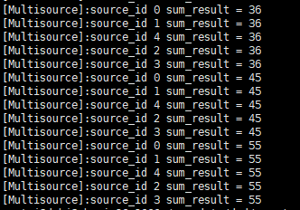

# 多路输入
同一个method，框架支持多路数据输入，每一路数据指定一个专属的sourceid；处理output时，根据sourceid处理不同通路的输出结果。注意`sourceid`字段必须从0开始编号，比如有4路输入，则每一路的sourceid分别是0、1、2、3.

## 设置method支持多路输入
首先介绍下MethodInfo属性中的字段`bool is_src_ctx_dept_`，默认为false，该字段表示Method对输入数据的处理是否依赖输入源。比如MOT Method，会记录前几帧数据并分配track_id，摔倒检测的Method也会依赖前几帧的输入，这类Method需要将属性设置为`is_src_ctx_dept_ = true`。

本示例中，method实现了累加功能，本质上是is_src_ctx_dept_=false，为了演示该特性，设置method的字段is_src_ctx_dept_为true。
```c++
xstream::MethodInfo methodinfo;
methodinfo.is_need_reorder_ = false;
methodinfo.is_src_ctx_dept_ = true; // 支持多路输入
methodinfo.is_thread_safe_ = false;
xstream::MultiSourceMethod::SetMethodInfo(methodinfo);
```
## 指定sourceid
准备input数据时，指定每一路的sourceid，处理output数据时会用到此处设置的sourceid用来区分是哪一路的output数据。
```c++
for (int num = 1; num <= 10; num++) {
    for (auto source_id : source_ids) {
      inputdata->source_id_ = source_id;//  每一路输入指定一个独立的sourceid
      test_input = std::make_shared<MultiSourceInput>();
      test_input->name_ = "test_input";
      test_input->sum_in = num;
      inputdata->datas_[0] = BaseDataPtr(test_input);
      flow->AsyncPredict(inputdata);
    }
  }
```

# 示例
示例method完成一个累加功能：对于每一个输入，进行累加并输出累加后的结果。
这里指定了5路输入，每一路分别输入1~10十个数据，最后观察每一路预测结果是否为55。
## 示例编译
进入framework目录，执行如下命令
```c++
mkdir build
cd build
cmake ..
make -j
```
编译完成后，可执行程序生成到build/bin目录下

## 示例运行
进入build目录，拷贝stage8/config下的配置文件到build目录
执行命令：
```c++
./tutorials/stage4/stage4_multisource ./config/multisource_test.json
```
## 示例运行截图
