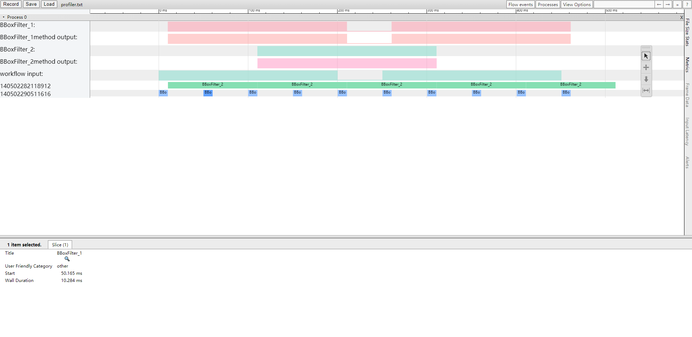

# Profile功能

# 简介

xstream内部提供了性能分析工具，用户可以通过打开Profile功能查看相关性能信息，目前支持处理时间和帧率两种性能数据的统计。

本教程将展示串联2个method，并对两个method的性能进行统计分析，通过示例来展示如何使用profiler功能。

# 开始

## 第1步： 构建workflow

我们构造一个workflow，这个workflow中什么也不做，只是数据流动和一些普通计算。

```json
// xstream/tutorials/stage6_profile/config/filter.json
 1    {
 2      "inputs": [
 3        "head_box"
 4      ],
 5      "outputs": [
 6        "head_box_filter2"
 7      ],
 8      "workflow": [
 9        {
10          "method_type": "BBoxFilterA",
11          "unique_name": "BBoxFilter_1",
12          "inputs": [
13            "head_box"
14          ],
15          "outputs": [
16            "head_box_filter"
17          ],
18          "method_config_file": "null"
19        },
20        {
21          "method_type": "BBoxFilterB",
22          "unique_name": "BBoxFilter_2",
23          "inputs": [
24            "head_box_filter"
25          ],
26          "outputs": [
27            "head_box_filter2"
28          ],
29          "method_config_file": "null"
30        }
31      ]
32    }
```

xstream的配置文件是以json格式为主，filter.json每个字段的解释如下:

line 2: inputs字段，用来表示整个workflow的输入，这里输入的是head_box(人头框)。

line 5: outputs字段，用来表示整个workflow的输出，这里输出的是head_box_filter2(经过filter2过滤后人头框)。

line 8: workflow字段，用来表示整个workflow的开始，方括号[ ]中的内容包含整个workflow中的method结点。

line 10: method_type字段，用来表示method的类型，对应代码里的BBoxFilterA类(bbox_filter_a.h)。

line 11: unique_name字段，用于xstream框架内部node的标识（这里可暂时不关注）。

line 12: inputs字段，用来标识workflow这个json数组第1个元素的输入，即用来标识workflow中第1个method结点的输入，这里value是head_box，也就是整个workflow的输入作为第1个method结点的输入，从这个method结点开始被处理。

line 15: outputs字段，用来表示workflow中第一个method结点的输出，即，head_box_filter。

line 18: method_config_file字段，用来表示每个method结点对应的配置文件。（在stage6中没有用到）。

line 21: method_type字段，workflow的第二个元素的method类型，对应代码中的BBoxFilterB类(bbox_filter_b.h)。

line 22: unique_name字段，用于xstream框架内部node的标识（这里可暂时不关注）。

line 23: inputs字段，用来标识workflow这个json数组第2个元素的输入，即用来标识workflow中第2个method结点的输入，这里value是head_box_filter，也就是workflow中第1个method结点的输出作为第2个method结点的输入。

line 26: outputs字段，用来表示workflow中第2个method结点的输出，即，head_box_filter2，同时因为BBoxFilterB也是workkflow的最后一个结点，这里它也是整个workflow中输出的一部分，对应line6中的head_box_filter2。

line 29: method_config_file字段，用来表示每个method结点对应的配置文件。（在stage6中没有用到）。


## 第2步：定义xstream框架的数据结构

为了方便地对数据进行统一的处理，xstream模块内部流动的数据有统一的格式，都继承自BaseData类，也就是每个流动的数据中的都有BaseData类中的成员。

BaseData类定义如下：

```C++
// xstream/framework/include/hobotxstream/xstream_data.h
struct BaseData {
  BaseData();
  virtual ~BaseData();
  // type
  std::string type_ = "";
  // name
  std::string name_ = "";
  // error code
  int error_code_ = 0;
  // error detail info
  std::string error_detail_ = "";
  // context of C structure
  std::shared_ptr<CContext> c_data_;
  // data status
  DataState state_ = DataState::VALID;
};

```

继承自BaseData类的BBox类定义如下：

```C++
// xstream/tutorials/stage6_profile/include/method/bbox.h
struct BBox : public BaseData {
  inline BBox() {}
  inline BBox(float x1_, float y1_, float x2_, float y2_,
              float score_ = 0) {
    x1 = x1_;
    y1 = y1_;
    x2 = x2_;
    y2 = y2_;
    score = score_;
  }
  inline float Width() const { return (x2 - x1); }
  inline float Height() const { return (y2 - y1); }
  inline float CenterX() const { return (x1 + (x2 - x1) / 2); }
  inline float CenterY() const { return (y1 + (y2 - y1) / 2); }

  inline friend std::ostream &operator<<(std::ostream &out, BBox &bbox) {
    out << "( x1: " << bbox.x1 << " y1: " << bbox.y1 << " x2: " << bbox.x2
        << " y2: " << bbox.y2 << " score: " << bbox.score << " )";
    return out;
  }

  inline friend std::ostream &operator<<(std::ostream &out, const BBox &bbox) {
    out << "( x1: " << bbox.x1 << " y1: " << bbox.y1 << " x2: " << bbox.x2
        << " y2: " << bbox.y2 << " score: " << bbox.score << " )";
    return out;
  }

  float x1 = 0;
  float y1 = 0;
  float x2 = 0;
  float y2 = 0;
  float score = 0;
};

typedef std::shared_ptr<BBox> BBoxPtr;

```

## 第3步：根据具体需求，定义Method

根据具体需求，定义具体的Method, 以BBoxFilterA为例：

```C++
// xstream/tutorials/stage6_profile/include/method/bbox_filter_a.h
class BBoxFilterA : public SimpleMethod {
 public:
  int Init(const std::string &config_file_path) override;

  virtual std::vector<BaseDataPtr> DoProcess(
      const std::vector<BaseDataPtr> &input,
      const xstream::InputParamPtr &param);

  void Finalize() override;

  int UpdateParameter(InputParamPtr ptr) override;

  InputParamPtr GetParameter() const override;

  std::string GetVersion() const override;

 private:
  std::atomic<float> area_threshold_;
};

class BBoxFilterAParam : public xstream::InputParam {
 public:
  explicit BBoxFilterAParam(const std::string &module_name) :
           xstream::InputParam(module_name) {}
  std::string Format() override {
    return "";
  }
};
```

BBoxFilterA类中，DoProcess为需要使用者自己实现的成员函数，xstream模块内部会通过回调，调用DoProcess成员函数，通过DoProcess，对输入的数据(head_box)进行过滤处理。

```C++
std::vector<BaseDataPtr> BBoxFilterA::DoProcess(
    const std::vector<BaseDataPtr> &input,
    const InputParamPtr &param) {

  std::cout << "BBoxFilterA::DoProcess begin " << input.size() << std::endl;
  std::vector<BaseDataPtr> output;
  // one batch
  for (size_t j = 0; j < input.size(); j++) {
    output.push_back(std::make_shared<BaseDataVector>());
    if (input[j]->state_ == DataState::INVALID) {
      // std::cout << "input slot " << j << " is invalid" << std::endl;
      continue;
    }
    auto in_rects = std::static_pointer_cast<BaseDataVector>(input[j]);
    auto out_rects = std::static_pointer_cast<BaseDataVector>(output[j]);
  }
  std::this_thread::sleep_for(std::chrono::milliseconds(10));
  std::cout << "BBoxFilterA::DoProcessing end " << std::endl;
  return output;
}
```

## 第4步：在Method中，注册Profile相关函数

在第3步的DoProcess第一行，加入如下语句，用于注册Profile功能中帧率(FPS)的统计分析。
```C++
RUN_FPS_PROFILER("BBoxFilterA")
```

添加后的DoProcess函数如下：

```C++
// xstream/tutorials/stage6_profile/include/method/bbox_filter_a.cc
std::vector<BaseDataPtr> BBoxFilterA::DoProcess(
    const std::vector<BaseDataPtr> &input,
    const InputParamPtr &param) {
  RUN_FPS_PROFILER("BBoxFilterA")

  std::cout << "BBoxFilterA::DoProcess begin " << input.size() << std::endl;
  std::vector<BaseDataPtr> output;
  // one batch
  for (size_t j = 0; j < input.size(); j++) {
    output.push_back(std::make_shared<BaseDataVector>());
    if (input[j]->state_ == DataState::INVALID) {
      // std::cout << "input slot " << j << " is invalid" << std::endl;
      continue;
    }
    auto in_rects = std::static_pointer_cast<BaseDataVector>(input[j]);
    auto out_rects = std::static_pointer_cast<BaseDataVector>(output[j]);
  }
  std::this_thread::sleep_for(std::chrono::milliseconds(10));
  std::cout << "BBoxFilterA::DoProcessing end " << std::endl;
  return output;
}
```
BBoxFilterA和BBoxFilterB实现基本一致，只是注册Profile功能中，使用的是运行时间(TIME)的统计分析。

```C++
RUN_PROCESS_TIME_PROFILER("BBoxFilterB")
```

## 第5步：注册Method到MehtodFactory中

在使用BBoxFilterA和BBoxFilterB类之前，要注册这两个类到xstream的MethodFactory中。对应xstream/tutorials/stage6_profile/config/filter.json中的method_type字段。

```C++
// xstream/tutorials/stage6_profile/include/method/method_factory.cc
MethodPtr CreateMethod(const std::string &method_name) {
  if (method_name == "BBoxFilterA") {
    return MethodPtr(new BBoxFilterA());
  } else if (method_name == "BBoxFilterB"){
    return MethodPtr(new BBoxFilterB());
  } else {
    return MethodPtr();
  }
}
```

## 第6步：编写main函数，串联整个workflow(带有Profile功能)
```C++
// xstream/tutorials/stage6_profile/src/main.cc
int main(int argc, char const *argv[]) {
  using Stage6Async::Callback;
  using xstream::BaseData;
  using xstream::BaseDataPtr;
  using xstream::BaseDataVector;
  using xstream::InputData;
  using xstream::InputDataPtr;

  xstream::XStreamSDK *flow = xstream::XStreamSDK::CreateSDK();

  int num = 10;
  flow->SetConfig("config_file", "./config/filter.json");
  flow->SetConfig("profiler", "on");
  flow->SetConfig("profiler_name", "flow");
  flow->SetConfig("profiler_file", "./profiler.txt");
  flow->SetConfig("profiler_frame_interval", "8");
  flow->SetConfig("profiler_time_interval", "100");

  Callback callback;
  flow->SetCallback(
      std::bind(&Callback::OnCallback, &callback, std::placeholders::_1));
  flow->Init();
  std::cout << "========Init Finish==============" << std::endl;
  flow->SetCallback(
      std::bind(&Callback::OnCallback, &callback, std::placeholders::_1),
      "BBoxFilter_1");
  flow->SetCallback(
      std::bind(&Callback::OnCallback, &callback, std::placeholders::_1),
      "BBoxFilter_2");

  float x1{0};   // BBox(框)的左上角横坐标
  float y1{20};  // BBox(框)的左上角纵坐标
  float x2{0};   // BBox(框)的右上角横坐标
  float y2{50};  // BBox(框)的右上角纵坐标

  for (int i = 0; i < num; i++) {
    x2 = i;
    
    xstream::BBox *bbox(
        new xstream::BBox(x1, y1, x2, y2));
    bbox->type_ = "BBox";

    BaseDataVector *data(new BaseDataVector);
    data->datas_.push_back(BaseDataPtr(bbox));
    data->name_ = "head_box";

    InputDataPtr inputdata(new InputData());
    inputdata->datas_.push_back(BaseDataPtr(data));

    flow->AsyncPredict(inputdata);
    std::this_thread::sleep_for(std::chrono::milliseconds(50));
  }
  
  delete flow;
  
  return 0;
}
```

因为xstream的profile性能分析功能默认是关闭的，所以需要在 xstream::XStreamSDK中，主动打开。

打开的接口：

```C++
int SetConfig(const std::string &key, const std::string &value);
```

key为"profiler", value为"on", 表示打开性能统计功能。"off"表示关闭, 默认为关闭。

key为"profiler_file", value为性能统计输出文件路径，用于设置性能统计文件的路径名称，框架层次的统计数据输出至该文件。


## 第7步：编译

进入xstream/framework/目录下，执行如下命令，进行编译

```bash
cd xstream/framework/
mkdir build
cmake ..
make
```

## 第8步：运行

进入xstream/framework/目录下，执行如下命令，运行stage6_profile

```bash
cd xstream/tutorials/stage6_profile
cp -rf ../../../tutorials/stage6_profile/config/ .
./stage6_profile
```

## 第9步：运行结果展示与查看

运行后，会将性能统计分析的结果输出到profiler.txt文件，可以打开Chrome浏览器，在地址栏输入: chrome://tracing/ ，通过页面的Load按钮，将profiler.txt文件加载进来，即可看到性能统计数据分析的可视化结果，可视化结果中，横坐标表示时间。纵坐标的字母项，表示对应的Method结点函数的帧率；纵坐标的数字，表示不同的线程id所消耗的时间。页面同时提供了缩放、拖动等工具，可帮助查看统计数据细节。


