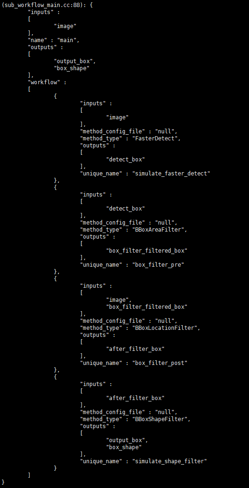
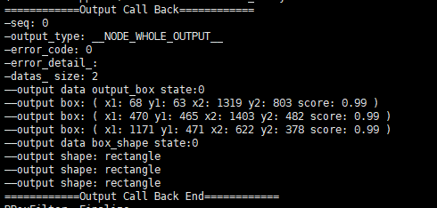

# 子workflow
在编写workflow配置时，独立的mothods可以形成一个单独的子workflow，子workflow能被其他workflow引用，简化workflow的复杂程度。
## 子workflow
配置文件以json格式表示。

json中，{} 表示一个对象。

配置文件中，有如下几种对象：
* Root
* Template
* TemplateRef
* Workflow
* Node
### Root对象
基本格式如下：
```c++
{
    "type": "root",    // 表示Root对象
    "version": "1.1",  // 表示配置版本，可选
    "templates": [     // Template对象，可选
    ],
    "workflows": [     // Workflow对象
    ]
}
```
Root对象包含了：
* version：协议的版本；
* templates：定义的模板；
* workflows：定义的工作流；
### Template对象

Template对象用于模板功能。用户可以通过Template对象定义一些带参数的模板，然后通过TemplateRef对象引用这些模板，即可实例化对象。

基本格式如下：
```c++
{
    "type": "template",           // 表示Template对象
    "template_name": "XXX",      // 模板名称，需唯一化
    "parameters": [               // 模板参数
    ],
    "template": {                 // 模板内容
    }
}
```
* template_name 字段表示该模板名称，是模板的唯一性标志；
* parameters 字段指明了这个template所需要的参数；
* template 字段是这个模板的内容；在模板内容中，XXX格式的字符串，表示parameters字段中所定义的参数，在实例化该模板时直接替换为参数内容。需要注意，在定义的模板中，若存在输入输出name参数，只需在global inputs、outputs用${name}格式表示，模板其他位置直接用参数name表示。
本示例中，定义一个名为"test_filter.tpl"的Template对象：
```c++
{
    "type": "template",
    "template_name": "test_filter.tpl",
    "parameters": [
        "name",
        "area_method",
        "location_method",
        "image",
        "detect_box",
        "output_box"
    ],
    "template": {
        "name": "${name}",
        "type": "workflow",
        "inputs": [
            "${image}",
            "${detect_box}"
        ],
        "outputs": [
            "${output_box}"
        ],
        "workflow": [
            {
                "type": "node",
                "method_type": "${area_method}",
                "unique_name": "pre",
                "method_config_file": "null",
                "inputs": ["detect_box"],
                "outputs": ["filtered_box"]
            },
            {
                "type": "node",
                "method_type": "${location_method}",
                "unique_name": "post",
                "method_config_file": "null",
                "inputs": [
                        "image",
                        "filtered_box"
                ],
                "outputs": [
                        "output_box"
                ]
            }
        ]
    }
}
```
### TemplateRef对象
TemplateRef对象即对之前定义的Template的引用。
基本格式如下：
```c++
{
    "type": "template_ref",       // 表示TemplateRef对象
    "template_name": "XXXX",      // 引用的模板名称
    "parameters": {               // 模板参数
    }
}
```
其中：
* template_name 指明了需要引用的template的名字；
* parameters 指定了这个template 所需要的参数的值。

如下所示，定义了一个TemplateRef对象：
```c++
{
    "type": "template_ref",
    "template_name": "test_filter.tpl",
    "parameters": {
    "name": "box_filter",
    "area_method": "BBoxAreaFilter",
    "location_method": "BBoxLocationFilter",
    "image": "image",
    "detect_box": "detect_box",
    "output_box": "after_filter_box"
    }
}
```
结合Template对象，上述TemplateRef对象会被展开，等价于如下定义：
```c++
{
    "name": "box_filter",
    "type": "workflow",
    "inputs": [
        "image",
        "detect_box"
    ],
    "outputs": [
        "after_filter_box"
    ],
    "workflow": [
        {
            "inputs" :
            [
                "detect_box"
            ],
            "method_config_file" : "null",
            "method_type" : "BBoxAreaFilter",
            "outputs" :
            [
                "box_filter_filtered_box"
            ],
            "unique_name" : "box_filter_pre"
        },
        {
            "inputs" :
            [
                "image",
                "box_filter_filtered_box"
            ],
            "method_config_file" : "null",
            "method_type" : "BBoxLocationFilter",
            "outputs" :
            [
                "after_filter_box"
            ],
            "unique_name" : "box_filter_post"
        }
    ]
}
```
### Workflow对象
基本格式如下：
```c++
{
    "name": "xxx",         // workflow名称，需唯一化
    "type": "workflow",    // 表示Workflow对象
    "inputs": [],          // 输入slots名称
    "outputs": [],         // 输出slots名称
    "workflow": [          // Workflow内容，包括Node或Workflow对象(子workflow)
    ]
}
```
workflow示例，其中用到了已定义的Template对象"test_filter.tpl"：
```c++
{
    "version": "1.1",
    "templates": [
        "@include: ./filter_tpl.json"
    ],
    "workflows": [
    {
        "name": "main",
        "type": "workflow",
        "inputs": [
            "image"
        ],
        "outputs": [
            "output_box",
            "box_shape"
        ],
        "workflow": [
        {
            "type": "node",
            "method_type": "FasterDetect",
            "unique_name": "simulate_faster_detect",
            "inputs": [
                "image"
            ],
            "outputs": [
                "detect_box"
            ],
            "method_config_file": "null"
        },
        {
            "type": "template_ref",
            "template_name": "test_filter.tpl",
            "parameters": {
                "name": "box_filter",
                "area_method": "BBoxAreaFilter",
                "location_method": "BBoxLocationFilter",
                "image": "image",
                "detect_box": "detect_box",
                "output_box": "after_filter_box"
            }
        },
        {
            "type": "node",
            "method_type": "BBoxShapeFilter",
            "unique_name": "simulate_shape_filter",
            "inputs": [
                "after_filter_box"
            ],
            "outputs": [
                "output_box",
                "box_shape"
            ],
            "method_config_file": "null"
        }
        ]
    }
    ]
}
```

# sub_workflow示例
示例中定义一个名为"test_filter.tpl"的Template对象，对于输入的box对象，其功能如下：
* node1过滤面积过小的box
* node2过滤靠近图像边缘的box

sub_workflow_config.json定义总的workflow，输入为一个image，最终输出为检测的box形状结果：
* node1：对于输入的image，输出检测的box列表，test示例中每次运行输出随机的box列表
* node2：包含test_filter.tpl的子workflow，此处最终会展开两个method
* node3: 判断box是否为正方形，输入0或1的结果

## 编译
进入framework目录，执行如下命令
```c++
mkdir build
cd build
cmake ..
make -j
```
编译完成后，可执行程序生成到build/bin目录下

## 运行
进入build目录，拷贝stage8/config下的配置文件到build目录
执行命令运行app：
```c++
./tutorials/stage8/stage8_sub_workflow ./config/sub_workflow_config.json
```
## 运行结果
### 展开后的workflow

### 运行结果展示
