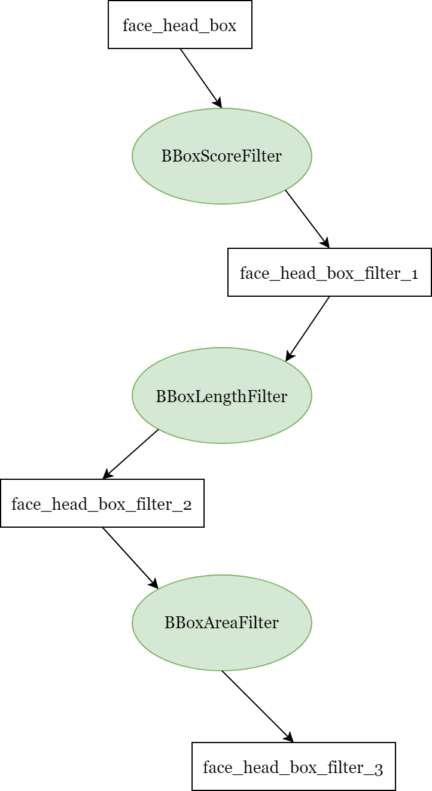
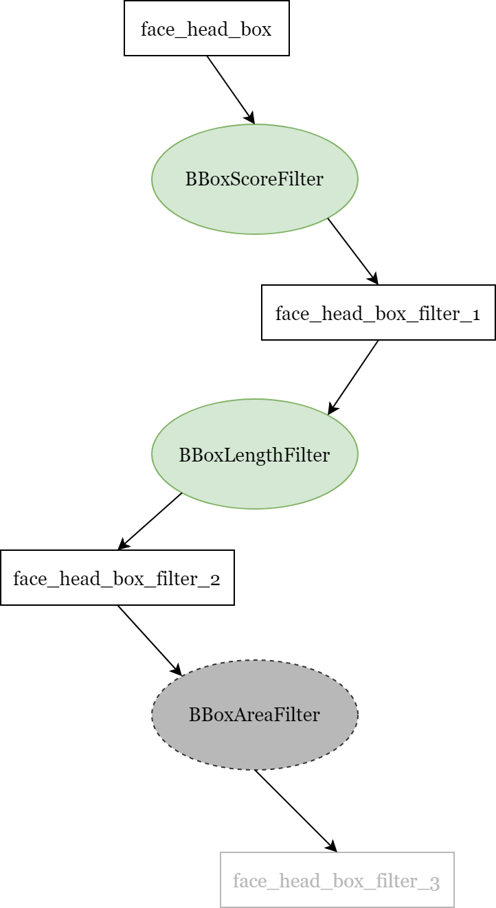
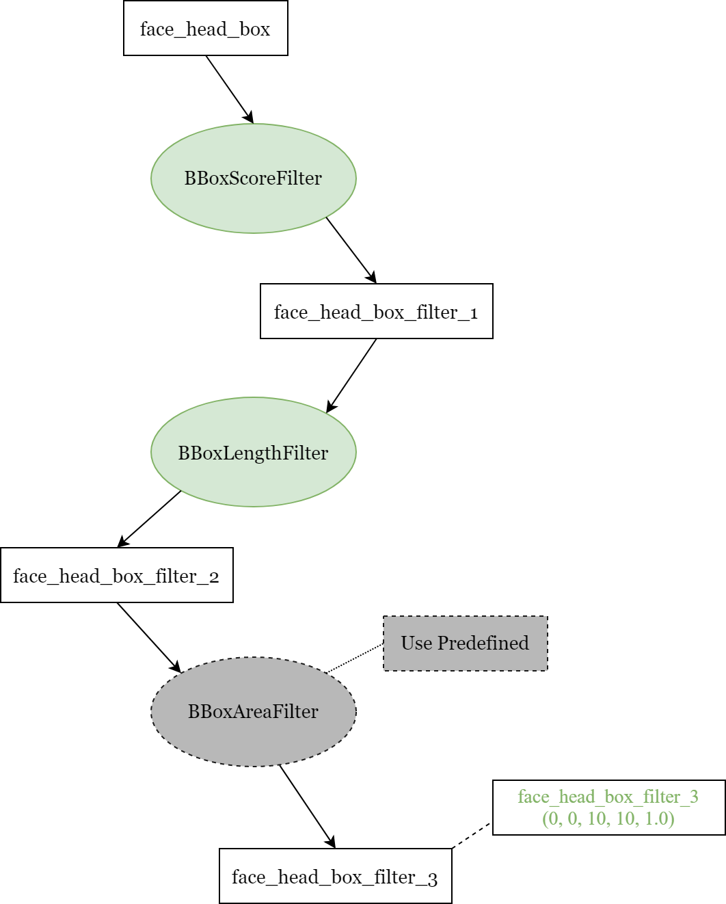
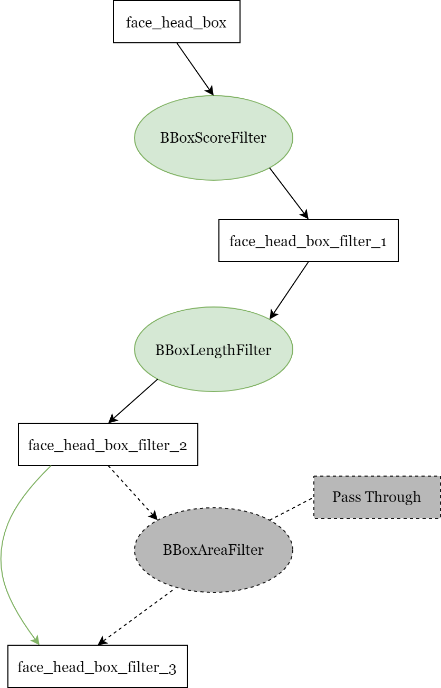
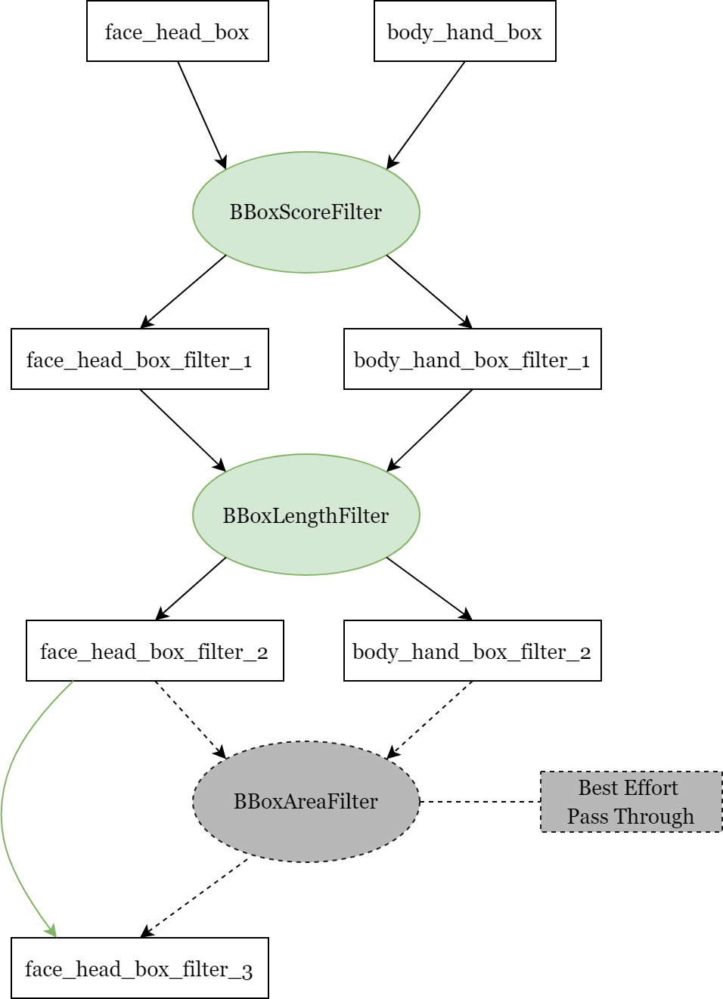
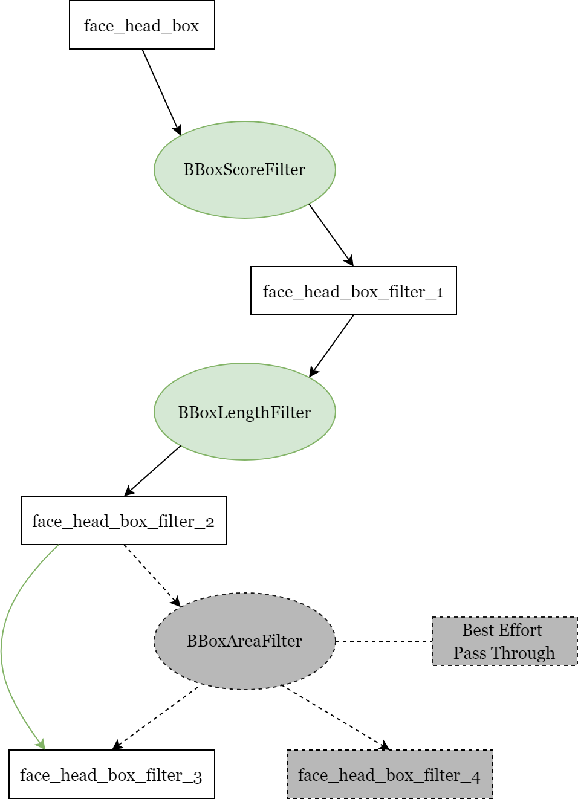

## 关闭指定的method实例
在一些应用场景中，我们需要根据应用场景来关闭某些method实例计算节点node。例如, 通过外部传入人脸照片，提取特征时，创建底库时, 需要运行人脸检测，特征提取计算, 但不需要再进行人脸mot跟踪, mot method的计算节点就可以关闭。 在关闭不必要的计算节点的情况下，可以降低芯片的功耗，降低系统的延迟。
XSTREAM提供了一下几种关闭Method的方式：

| 模式    | 详细说明|
| :-----: |:------:|
| Invalid | 令每个输出都是INVALID的BaseData    |
| PassThrough  |  透传输入数据到输出，要求输入数据与输出数据个数一致,且类型相同 |
| UsePreDefine |  拷贝先验数据到输出，要求先验数据个数与输出数据个数一致, 且类型相同 |
| BestEffortPassThrough | 按顺序逐个透传输入数据到输出， 如果输入数据大小多于输出，则只透传前面的slot。如果输入数据大小少于输出，则多余的输出slot为Invalid的BaseData |

本节将基于下面的workflow来介绍上述4种控制模式，workflow输入数据是face_head_box, 输入数据先后经过BBoxScoreFilter、BBoxLengthFilter、BBoxAreaFilter三个节点的运算，最终输出数据是face_head_box_filter_3。其中BBoxScoreFilter作用是过滤掉置信度小于阈值的框，BBoxLengthFilter作用是过滤掉边长小于阈值的框、BBoxAreaFilter过滤面积小于阈值的框。

```json
{
  "max_running_count": 10000,
  "inputs": ["face_head_box"],
  "outputs": ["face_head_box_filter_3"],
  "workflow": [
    {
      "method_type": "BBoxScoreFilter",
      "unique_name": "bbox_score_filter",
      "inputs": [
        "face_head_box"
      ],
      "outputs": [
        "face_head_box_filter_1"
      ],
      "method_config_file": "null"
    },
    {
      "method_type": "BBoxLengthFilter",
      "unique_name": "bbox_length_filter",
      "inputs": [
        "face_head_box_filter_1"
      ],
      "outputs": [
        "face_head_box_filter_2"
      ],
      "method_config_file": "null"
    },
	  {
      "method_type": "BBoxAreaFilter",
      "unique_name": "bbox_area_filter",
      "inputs": [
        "face_head_box_filter_2"
      ],
      "outputs": [
        "face_head_box_filter_3"
      ],
      "method_config_file": "null"
    }
  ]
}
```

对应的Workflow结构图如下所示：




定义XStream框架BBox数据结构
```c++
// method/bbox.h
struct BBox : public BaseData {
  inline BBox() {}
  inline BBox(float x1_, float y1_, float x2_, float y2_,
              float score_ = 0) {
    x1 = x1_;
    y1 = y1_;
    x2 = x2_;
    y2 = y2_;
    score = score_;
  }

  float x1 = 0;
  float y1 = 0;
  float x2 = 0;
  float y2 = 0;
  float score = 0;
};
typedef std::shared_ptr<BBox> BBoxPtr;
```

### 0. Normal Mode
首先来看下正常情况下，构造BBox数组，经过上述workflow后的输出。设置信度阈值score_threshold_ = 0.5，length_threshold_ = 5，area_threshold_ = 50。构造输入数据如下：
```c++
  // prepare input data
  InputDataPtr inputdata(new InputData());
  BaseDataVector *data(new BaseDataVector);
  xstream::BBoxPtr bbox1 = std::make_shared<xstream::BBox>(0, 0, 10, 20, 0.1);
  xstream::BBoxPtr bbox2 = std::make_shared<xstream::BBox>(0, 0, 4, 5, 0.8);
  xstream::BBoxPtr bbox3 = std::make_shared<xstream::BBox>(0, 0, 6, 8, 0.7);
  xstream::BBoxPtr bbox4 = std::make_shared<xstream::BBox>(0, 0, 8, 8, 0.9);
  // set input data name
  data->name_ = "face_head_box";   // corresponding the inputs in workflow
  data->datas_.push_back(bbox1);
  data->datas_.push_back(bbox2);
  data->datas_.push_back(bbox3);
  data->datas_.push_back(bbox4);
  inputdata->datas_.push_back(BaseDataPtr(data));
```

正常运行模式下将输入数据送入框架，输出结果只包括BBox(0, 0, 8, 8, 0.9).
```c++
  // Create xstream sdk object
  xstream::XStreamSDK *flow = xstream::XStreamSDK::CreateSDK();
  flow->SetConfig("config_file", "./config/control_workflow.json");
  flow->Init();

  // common predict
  auto out = flow->SyncPredict(inputdata);
```

输出结果：
```
============Output Call Back============
—seq: 0
—output_type: __NODE_WHOLE_OUTPUT__
—error_code: 0
—error_detail_: 
—datas_ size: 1
——output data face_head_box_filter_3 state:0
——output data: ( x1: 0 y1: 0 x2: 8 y2: 8 score: 0.9 )
============Output Call Back End============
```


### 1. Invalid Mode
若希望暂时停止上述workflow中BBoxAreaFilter节点的运行，即将bbox_area_filter节点设置为Invalid模式。

对应的Workflow结构图如下所示：



设置Invalid参数：
```c++
  // 2 set DisableParam Invalid for "bbox_area_filter"
  xstream::InputParamPtr invalidFilter3(
    new xstream::DisableParam("bbox_area_filter", xstream::DisableParam::Mode::Invalid));
  // add invalid parameter to inputdata params_
  inputdata->params_.push_back(invalidFilter3);
  // start synchronous predict, and then get output
  out = flow->SyncPredict(inputdata);
```

此时"bbox_area_filter"节点输出数据被标记为INVALID，即data状态设置为`state=4`。
```
============Output Call Back============
—seq: 1
—output_type: __NODE_WHOLE_OUTPUT__
—error_code: 0
—error_detail_: 
—datas_ size: 1
——output data face_head_box_filter_3 state:4
============Output Call Back End============
```

  **注意**：将一个Node节点设置为INVALID Mode，若该节点的输出数据被其他节点依赖，需要注意后续节点的输出也会被影响，且要保证后续节点有处理Invalid异常输入数据的能力。

下面我们看下若将BBoxLengthFilter节点设置为Invalid Mode，最终的输出有何变化。
```c++
// 3 set DisableParam Invalid output "bbox_length_filter"
  xstream::InputParamPtr invalidFilter2(
    new xstream::DisableParam("bbox_length_filter", xstream::DisableParam::Mode::Invalid));
  // add invalid parameter to inputdata params_
  inputdata->params_.clear();
  inputdata->params_.push_back(invalidFilter2);
  // start synchronous predict, and then get output
  out = flow->SyncPredict(inputdata);
```

输出如下，可以看到输出数据face_head_box_filter_3的状态是0(Valid)，但内部其实不包含任何BBox数据。
```
============Output Call Back============
—seq: 2
—output_type: __NODE_WHOLE_OUTPUT__
—error_code: 0
—error_detail_: 
—datas_ size: 1
——output data face_head_box_filter_3 state:0
============Output Call Back End============
```

### 2. Use Predefined Mode
Use Predefined模型与Invalid模型类似，它是通过人工指定相关Node的输出数据，而跳过Node节点计算。类似地，将BBoxAreaFilter节点设置为Use Predefined Mode，具体做法如下。

对应的Workflow结构图如下所示：



准备输入数据(同上)，准备pre_define数据BBox(0, 0, 10, 10, 1.0)：
```c++
InputDataPtr inputdata(new InputData());
  BaseDataVector *data(new BaseDataVector);
  xstream::BBoxPtr bbox1 = std::make_shared<xstream::BBox>(0, 0, 10, 20, 0.1);
  xstream::BBoxPtr bbox2 = std::make_shared<xstream::BBox>(0, 0, 4, 5, 0.8);
  xstream::BBoxPtr bbox3 = std::make_shared<xstream::BBox>(0, 0, 6, 8, 0.7);
  xstream::BBoxPtr bbox4 = std::make_shared<xstream::BBox>(0, 0, 8, 8, 0.9);
  data->name_ = "face_head_box";   // corresponding the inputs in workflow
  data->datas_.push_back(bbox1);
  data->datas_.push_back(bbox2);
  data->datas_.push_back(bbox3);
  data->datas_.push_back(bbox4);
  inputdata->datas_.push_back(BaseDataPtr(data));

  // use pre-defined input data
  inputdata->params_.clear();
  xstream::DisableParamPtr
      pre_define(
        new xstream::DisableParam(
          "bbox_area_filter",
          xstream::DisableParam::Mode::UsePreDefine));

  // preprea new input data
  BaseDataVector *pre_data(new BaseDataVector);
  xstream::BBoxPtr pre_bbox = std::make_shared<xstream::BBox>(0, 0, 10, 10, 1.0);
  pre_data->datas_.push_back(pre_bbox);
  pre_define->pre_datas_.emplace_back(BaseDataPtr(pre_data));

  inputdata->params_.push_back(pre_define);
```

按照正常模式，face_head_box_filter_3输出为BBox(0, 0, 8, 8, 0.9),但bbox_area_filter节点设置Use Predefined Mode后，输出结果如下：
```
============Output Call Back============
—seq: 0
—output_type: __NODE_WHOLE_OUTPUT__
—error_code: 0
—error_detail_: 
—datas_ size: 1
——output data face_head_box_filter_3 state:0
——output data: ( x1: 0 y1: 0 x2: 10 y2: 10 score: 1 )
============Output Call Back End============
```

### 3. PassThrough Mode
PassThrough Mode模式是直接将输入数据写为输出数据，从而跳过节点计算。PassThrough模式要求Node节点的输入数据和输出数据个数是一致的(InputData.data_.size() == InputData.data_.size())。

对于该Workflow，我们尝试用PassThrough方式关闭`bbox_area_filter`节点。
```c++
  // 2 prepare input data
  InputDataPtr inputdata(new InputData());
  BaseDataVector *data(new BaseDataVector);
  xstream::BBoxPtr bbox1 = std::make_shared<xstream::BBox>(0, 0, 10, 20, 0.1);
  xstream::BBoxPtr bbox2 = std::make_shared<xstream::BBox>(0, 0, 4, 5, 0.8);
  xstream::BBoxPtr bbox3 = std::make_shared<xstream::BBox>(0, 0, 6, 8, 0.7);
  xstream::BBoxPtr bbox4 = std::make_shared<xstream::BBox>(0, 0, 8, 8, 0.9);
  data->name_ = "face_head_box";   // corresponding the inputs in workflow
  data->datas_.push_back(bbox1);
  data->datas_.push_back(bbox2);
  data->datas_.push_back(bbox3);
  data->datas_.push_back(bbox4);
  inputdata->datas_.push_back(BaseDataPtr(data));

  // 3 set pass through output
  std::cout << "------------ pass through output----------" << std::endl;
  inputdata->params_.clear();
  xstream::InputParamPtr
      pass_through(
        new xstream::DisableParam(
          "bbox_area_filter",
          xstream::DisableParam::Mode::PassThrough));
  inputdata->params_.push_back(pass_through);
  auto out = flow->SyncPredict(inputdata);
```
此时实际运行时，Workflow结构如下：



正常运行模式下，输入数据经过BBoxScoreFilter、BBoxLengthFilter节点后，face_head_box_filter_2数据内容是BBox(0, 0, 6, 8, 0.7)和BBox(0, 0, 8, 8, 0.9)，再经过BBoxAreaFilter节点，face_head_box_filter_3数据内容是BBox(0, 0, 8, 8, 0.9)。而将BBoxAreaFilter节点设置为Pass Through Mode后，face_head_box_filter_3的数据是BBox(0, 0, 6, 8, 0.7)和BBox(0, 0, 8, 8, 0.9)，即与face_head_box_filter_2相同。

```
============Output Call Back============
—seq: 0
—output_type: __NODE_WHOLE_OUTPUT__
—error_code: 0
—error_detail_: 
—datas_ size: 1
——output data face_head_box_filter_3 state:0
——output data: ( x1: 0 y1: 0 x2: 6 y2: 8 score: 0.7 )
——output data: ( x1: 0 y1: 0 x2: 8 y2: 8 score: 0.9 )
============Output Call Back End============
```

### 4. Best Effort PassThrough Mode
PassThrough Mode模式将输入直接透传到输出，但是要求输入数据和输出数据字段数目一致。但是实际场景下，输入数据和输出数据并不匹配。Best Effort PassThrough Mode模式支持在输入数据字段多于输出字段数目时，只透传前面的数据字段。如果输入数据字段少于输出字段数目时，则多余的输出字段写为Invalid。

BestEffortPassThrough是PassThrough的改进版本，多数情况下更推荐使用BestEffortPassThrough模式。

以下面的workflow为例，输入数据是face_head_box、body_hand_box，输出数据是face_head_box_filter_3。
```json
{
  "max_running_count": 10000,
  "inputs": ["face_head_box", "body_hand_box"],
  "outputs": ["face_head_box_filter_3"],
  "workflow": [
    {
      "method_type": "BBoxScoreFilter",
      "unique_name": "bbox_score_filter",
      "inputs": [
        "face_head_box",
        "body_hand_box"
      ],
      "outputs": [
        "face_head_box_filter_1",
        "body_hand_box_filter_1"
      ],
      "method_config_file": "null"
    },
    {
      "method_type": "BBoxLengthFilter",
      "unique_name": "bbox_length_filter",
      "inputs": [
        "face_head_box_filter_1",
        "body_hand_box_filter_1"
      ],
      "outputs": [
        "face_head_box_filter_2",
        "body_hand_box_filter_2"
      ],
      "method_config_file": "null"
    },
	  {
      "method_type": "BBoxAreaFilter",
      "unique_name": "bbox_area_filter",
      "inputs": [
        "face_head_box_filter_2",
        "body_hand_box_filter_2"
      ],
      "outputs": [
        "face_head_box_filter_3"
      ],
      "method_config_file": "null"
    }
  ]
}
```

实际运行对应的workflow如下：



准备数据face_head_box包含框(0, 0, 10, 20, 0.1)、(0, 0, 7, 7, 0.8),body_hand_box包含框(0, 0, 6, 8, 0.7),(0, 0, 8, 8, 0.9);

```C++
InputDataPtr inputdata(new InputData());
  BaseDataVector *data1(new BaseDataVector);
  BaseDataVector *data2(new BaseDataVector);
  xstream::BBoxPtr bbox1 = std::make_shared<xstream::BBox>(0, 0, 10, 20, 0.1);
  xstream::BBoxPtr bbox2 = std::make_shared<xstream::BBox>(0, 0, 7, 7, 0.8);
  xstream::BBoxPtr bbox3 = std::make_shared<xstream::BBox>(0, 0, 6, 8, 0.7);
  xstream::BBoxPtr bbox4 = std::make_shared<xstream::BBox>(0, 0, 8, 8, 0.9);
  data1->name_ = "face_head_box";   // corresponding the inputs in workflow
  data2->name_ = "body_hand_box";   // corresponding the inputs in workflow
  data1->datas_.push_back(bbox1);
  data1->datas_.push_back(bbox2);
  data2->datas_.push_back(bbox3);
  data2->datas_.push_back(bbox4);
  inputdata->datas_.push_back(BaseDataPtr(data1));
  inputdata->datas_.push_back(BaseDataPtr(data2));
```

正常运行模式下，上述workflow的输出face_head_box_filter_3不包含任何框BBox，(0, 0, 10, 20, 0.1)被BBoxScoreFilter过滤，(0, 0, 7, 7, 0.8)被BBoxAreaFilter过滤。
```
============Output Call Back============
—seq: 0
—output_type: __NODE_WHOLE_OUTPUT__
—error_code: 0
—error_detail_: 
—datas_ size: 1
——output data face_head_box_filter_3 state:0
============Output Call Back End============
```

现在将节点BBoxAreaFilter设置为Best Effort PassThrough模式：
```c++
  // set best pass through output
  inputdata->params_.clear();
  xstream::InputParamPtr
    b_effort_pass_through(
      new xstream::DisableParam(
        "bbox_area_filter",
        xstream::DisableParam::Mode::BestEffortPassThrough));
  inputdata->params_.push_back(b_effort_pass_through);
```

BBoxAreaFilter节点的输入slot（"face_head_box_filter_2","body_hand_box_filter_2"）大于输出slot（"face_head_box_filter_3"），按照Best Effort PassThrough模式，会将"face_head_box_filter_2"透传给"face_head_box_filter_3"。

输出数据face_head_box_filter_3包含BBox(0, 0, 7, 7, 0.8)，即和face_head_box_filter_2一致：
```
============Output Call Back============
—seq: 1
—output_type: __NODE_WHOLE_OUTPUT__
—error_code: 0
—error_detail_: 
—datas_ size: 1
——output data face_head_box_filter_3 state:0
——output data: ( x1: 0 y1: 0 x2: 7 y2: 7 score: 0.8 )
============Output Call Back End============
```

接着以下面的workflow为例，输入数据是face_head_box，输出数据是face_head_box_filter_3，face_head_box_filter_4。
```json
{
  "max_running_count": 10000,
  "inputs": ["face_head_box"],
  "outputs": ["face_head_box_filter_3", "face_head_box_filter_4"],
  "workflow": [
    {
      "method_type": "BBoxScoreFilter",
      "unique_name": "bbox_score_filter",
      "inputs": [
        "face_head_box"
      ],
      "outputs": [
        "face_head_box_filter_1"
      ],
      "method_config_file": "null"
    },
    {
      "method_type": "BBoxLengthFilter",
      "unique_name": "bbox_length_filter",
      "inputs": [
        "face_head_box_filter_1"
      ],
      "outputs": [
        "face_head_box_filter_2"
      ],
      "method_config_file": "null"
    },
	  {
      "method_type": "BBoxAreaFilter",
      "unique_name": "bbox_area_filter",
      "inputs": [
        "face_head_box_filter_2"
      ],
      "outputs": [
        "face_head_box_filter_3",
        "face_head_box_filter_4"
      ],
      "method_config_file": "null"
    }
  ]
}
```

实际运行对应的workflow如下：



准备输入数据，包括框(0, 0, 10, 20, 0.1),(0, 0, 7, 7, 0.8),(0, 0, 6, 8, 0.7),(0, 0, 8, 8, 0.9):
```c++
  InputDataPtr inputdata(new InputData());
  BaseDataVector *data1(new BaseDataVector);
  xstream::BBoxPtr bbox1 = std::make_shared<xstream::BBox>(0, 0, 10, 20, 0.1);
  xstream::BBoxPtr bbox2 = std::make_shared<xstream::BBox>(0, 0, 7, 7, 0.8);
  xstream::BBoxPtr bbox3 = std::make_shared<xstream::BBox>(0, 0, 6, 8, 0.7);
  xstream::BBoxPtr bbox4 = std::make_shared<xstream::BBox>(0, 0, 8, 8, 0.9);
  data1->name_ = "face_head_box";   // corresponding the inputs in workflow
  data1->datas_.push_back(bbox1);
  data1->datas_.push_back(bbox2);
  data1->datas_.push_back(bbox3);
  data1->datas_.push_back(bbox4);
  inputdata->datas_.push_back(BaseDataPtr(data1));
```

设置BBoxAreaFilter为Best Effort PassThrough模式：
```c++
  inputdata->params_.clear();
  xstream::InputParamPtr
    b_effort_pass_through(
      new xstream::DisableParam(
        "bbox_area_filter",
        xstream::DisableParam::Mode::BestEffortPassThrough));
```

正常运行情况下，由于BBoxAreaFilter Method的输入输出slot是一致的，XStream Framework检查到Method的输出slot小于用户workflow中配置的Node输出slot时，程序会抛出错误。设置BBoxAreaFilter节点为Best Effort PassThrough模式后，该节点不再实际运行，直接由框架层做对应的透传处理。
输出结果如下，face_head_box_filter_3与face_head_box_filter_2一致，face_head_box_filter_4为Invalid状态：
```
============Output Call Back============
—seq: 0
—output_type: __NODE_WHOLE_OUTPUT__
—error_code: 0
—error_detail_: 
—datas_ size: 2
——output data face_head_box_filter_3 state:0
——output data: ( x1: 0 y1: 0 x2: 7 y2: 7 score: 0.8 )
——output data: ( x1: 0 y1: 0 x2: 6 y2: 8 score: 0.7 )
——output data: ( x1: 0 y1: 0 x2: 8 y2: 8 score: 0.9 )
——output data face_head_box_filter_4 state:4
============Output Call Back End============
```

### 总结
以上就是控制计算节点运行的4种方式: Invalid, UsePreDefine, PassThrough, BestEffortPassThrough。
* Invalid模式: 直接关闭节点，输出数据是INVALID。依赖其输出数据的后置网络，都会受到影响，无法输出期待的输出数据。
* UsePreDefine模式: 直接定义关闭节点的输出数据。在模拟, 测试等场景可以使用
* PassThrough模式: 直接将关闭节点的输入数据当做输出数据,前提是输入数据和输出相等。
* BestEffortPassThrough: 如果关闭节点的输入数据多于或等于输出数据，则按顺序将输入数据拷贝到输出数据；如果输入数据少于输出数据, 则多余的输出为Invalid的BaseData。BestEffortPassThrough模式是PassThrough模式的高阶版本。
