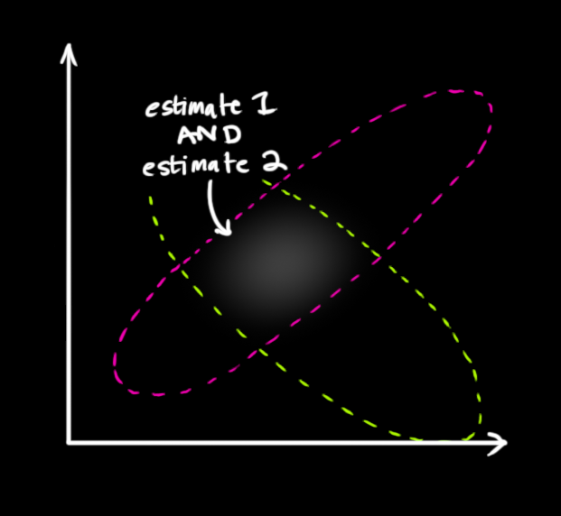

# MOTMethod

## Intro
多目标跟踪Method，用于检测框的跟踪、ID分配，目前aiexpress主要使用基于IOU的MOT跟踪策略。

## 算法介绍
目前aiexpress的motmethod采用基于IOU的跟踪算法，主要根据位置信息对目标进行跟踪。

算法主要分3个步骤

1) prediction 利用卡尔曼滤波器预测轨迹在当前帧的位置；

2) match 利用预测位置和观测位置得到匹配结果；

3) update 根据匹配结果对轨迹集合进行更新

下面详细介绍这三个步骤

### 卡尔曼滤波

#### 任务
在我们的多目标跟踪系统中，需要根据track在n-1时刻的最佳估计状态来推测当前时刻n的估计状态（并非最佳），然后再和观测到的target匹配。那么卡尔曼滤波的任务主要是两个方面：

1.根据track在n-1时刻的最佳估计状态X(n-1|n-1)推算出n时刻的估计状态X(n|n−1)，也称为先验估计。

2.融合n时刻的观测状态X(n)和先验估计X(n|n-1)得到更为准确的后验估计X(n|n),以此作为n+1时刻状态的预测基础。

#### 原理
本章节主要介绍卡尔曼滤波两大任务的原理。

##### 任务1 预测
首先，卡尔曼滤波假设系统中目标的位置和速度都是随机的，且服从高斯分布。每个变量有一个均值μ，以及方差ρ2，表示不确定性。在高斯分布中，均值μ是随机分布的中心，也是最有可能的状态。

在我们的系统状态中，位置和速度是有一定相关性的两个状态。如果速度过快，那么我们下一次观测时，目标的位置就会移动较远，如果速度过慢，目标下一次出现就会在附近，而我们只能观测到位置p这个值，然后通过位置信息来得到速度v，卡尔曼滤波的目的就是尽可能在包含不确定的测量数据中提取更多信息。

我们用协方差矩阵∑来表示这种相关性，其中∑(ij)表示第i个和第j个状态变量之间的相关度。在当前系统中，用协方差矩阵P来表示

.png "")

下面我们基于高斯分布来建立状态变量，在时刻n的状态变量为

.png "")

那么，经过t时间，n时刻的状态为

.png "")

这里我们有一个假设，就是本系统没有控制量B(n)。在一般的系统中，会有一个外部控制量，以火车运动状态为例的话，司机的加速减速就是一个外部控制量。
这里我们把转换矩阵F称为转换矩阵。


完成状态变量预测之后，我们要对协方差矩阵应用转换函数,更新协方差矩阵。但是因为存在外部干扰，仅仅做转换是不够的。X(n-1|n-1)的每个状态被移动到X(n|n-1)之后，将服从新的高斯分布，协方差为Qn，我们将这些没有被跟踪的干扰当作协方差为Qn的噪声处理。那么更新之后的P(n|n-1)如下：

.png "")

以上步骤我们就完成了预测的工作，得到了状态先验估计X(n|n-1)和协方差先验估计P(n|n-1)，此时就可以进行预测值和测量值的匹配。下面我们继续介绍卡尔曼滤波的任务2，根据测量值来修正估计值，得到更为准确的后验估计。

##### 任务2 修正估计值

修正先验估计，最小化其和真实值之间的差距。
很多实际情况下，测量值X(n)我们是不能直接测得的，可以测的是另一个量Z(n)，比如一些测距仪系统，只能测得时间间隔，而非实际距离，此时我们就需要借助测量矩阵H，将实际测得的数据转换到和预测值同一个度量空间，通过H计算出测量值的分布Z(n)，

.png "")

我们虽然可以得到测量值，但这种测量值跟真实值也是有区别的，也就是说存在不确定性，某些状态可能比我们的测量值更接近于真实状态，我们将这种不确定性用协方差R(n)表示，该分布的均值就是我们读到的测量值Z(n)。

那么现在我们得到了两个高斯分布，分别是估计值X(n)和测量值Z(n)，如下图，其中粉色表示预测值的分布，绿色表示测量值的分布



我们想要得到最优估计，也就是两者都发生的概率，那么将两个高斯分布相乘就可以了。而将两个不同均值和方差的高斯分布相乘，将得到一个新的高斯分布。

假设X(n)和Z(n)满足均值分别为μ1和μ2，协方差分别为ρ(1)2,ρ(2)2的高斯分布，融合之后通过计算可得分布满足均值为μ,协方差为ρ2，其中


令


则


将这里的K写出矩阵形式，则得

.png "")

现在我们用卡尔曼增益来修正先验估计X(n|n-1)和P(n|n-1),得到

.png "")

这里我们看到，如果K越大，测量值对修正值的贡献越大，K越小，预测值对修正值的贡献越大。
而K的取值从上式中看到，与预测噪声协方差P成正相关，和测量噪声协方差R成负相关。
所以，当P越大时，说明预测值的不确定性越高，同时卡尔曼增益越大，从而测量值对修正值的贡献更大。
这个结论也是我们在建模时选择参数的依据。

.png "")

到这里，卡尔曼滤波完成了修正先验估计的步骤，之后就不断迭代下去。

### 匹配track
经过卡尔曼滤波的预测步骤之后，我们得到track在当前帧的预测状态，现在要将预测状态和观测状态做匹配，然后选择可能性最大的tarck_id作为target的匹配id,这里的匹配的度量指标主要是IOU，IOU越大，表示预测框和当前观测框是同一个目标的可能性越大，其公式如下：


计算得到track和traget的IOU之后，我们将其组织成邻接矩阵aff，举例来说：
||1|2|3|
|:--:|:--:|:--:|:--:|
|1|120|110|0|
|2|0|0|150|
|3|320|220|500|
|4|280|0|370|
|5|0|85|20|
矩阵元素aff[1][2]表示track[1]和target[2]的IOU为110。

#### 简单匹配
我们在此临界矩阵的基础上首先进行简单匹配。
简单匹配的原则是track要选和它IOU最大的target，同时target也要选择和它IOU最大的track,如果两者都选择了对方，那么简单匹配成功。在上面的矩阵中，track[3]和target[3]互为对方最大的IOU，那么target就匹配的tarck_id即为3。

#### 匈牙利匹配
简单匹配完成后，对还没有匹配上的track和target进一步进行匈牙利匹配。匈牙利匹配的核心思想是匹配之后使得整个系统的损失最大或者最小化，比如在我们的IOU系统里，需要使匹配之后整个系统的IOU最大。
||1|2|
|:--:|:--:|:--:|
|1|120|110|
|2|0|0|
|4|280|0|
|5|0|85|
在我们的示例中，target[1]和track[4]匹配，target[2]和track[1]匹配可以使整个系统的IOU最大。但是匈牙利匹配得到的结果并不一定是唯一的，在上例中，如果我们把aff[4][2]设置为270,那么target[1]和track[1],target[2]和track[4]匹配也能使得IOU最大。

因此，在aiexpress的IOU2实现里就只使用了简单匹配方法。

## Usage
目前aiexpress中实现了两套MOT策略，分别为IOU和IOU2,都是基于IOU的目标跟踪策略，只在细节上有一些差别。两者区别在于IOU支持匈牙利匹配，IOU2只使用了简单匹配来匹配track和target。另外在IOU2中，算法提供了利用欧式距离来匹配目标的策略，主要应用在手部跟踪上。下面分别介绍一下两种实现的用法。

### IOU

#### 输入/输出

##### 输入

|Slot |内容 |备注 |
|:---:|:---------------:|:--------------:|
0 | XStreamBBox_list | 必要项

##### 输出

|Slot |内容 |备注 |
|:---:|:--------------------:|:---------------------------:|
0 | XStreamBBox_list | 带track_id
1 | XStreamUint32_List | disappeared_track_id_list

#### 配置文件

|字段      |描述     |默认值     |
|:-----------------------:|-----------------------------------------------------|:------:|
tracker_type|MOT工作模式，目前仅支持IOU based MOT|IOU
device|设备名称，若设置为X1，最大track_id为255，用以比对一致性|X2
update_no_target_predict|无检测框输入更新状态机track预测框，设置为true对主体连续运动且有遮挡的场景效果好，设置为false对主体不移动且有遮挡的场景效果好|false
support_hungarian|匈牙利匹配开关，打开匈牙利匹配id召回多，准确率下降；关闭则id召回少，准确率提升|false
need_check_merge|每组输入框IOU大于一定阈值做融合，该操作会影响输出数量，检测框融合多在检测模块完成，一般情况置为false|false
original_bbox|是否使用卡尔曼滤波器预测框，true为不使用，输出原始框坐标|true
max_track_target_num|状态机保存最大track数|512
max_det_target_num|输入框最大计算数|512
vanish_frame_count|消失帧数|30
time_gap|帧间隔时间|40

### IOU2

#### 输入/输出

##### 输入

|Slot |内容 |备注 |
|:---:|:---------------:|:--------------:|
0 | image | 必要项
1 | XStreamBBox_list | 必要项

##### 输出

|Slot |内容 |备注 |
|:---:|:--------------------:|:---------------------------:|
0 | XStreamBBox_list | 带track_id
1 | XStreamUint32_List | disappeared_track_id_list

#### 配置文件
|字段      |描述     |默认值     |
|:-----------------------:|-----------------------------------------------------|:------:|
match_type|匹配模式，目前支持IOU和Euclidean|IOU
tracker_type|MOT工作模式，目前仅支持IOU based MOT|IOU_2.0
use_kalman_filter|是否使用卡尔曼滤波器预测框，1为使用|1
missing_time_thres|目标不可见帧数阈值，超过则置为InVisible|2
vanish_frame_count|目标消失帧数阈值，超过则置为Deleted|4
time_gap|帧间隔时间|40
iou_thres|iou阈值，超过则进入匹配流程|0.2
euclidean_thres|欧式距离阈值，小于则进入匹配流程|200
use_location_gain|是否计算目标检测框和其他检测框的最小距离，1为使用|1
max_trajectory_number|状态机保存最大track数|3
min_score|目标检测框得分阈值|0.9
ignore_overlap_thres|筛选遮挡过大的box阈值,超过则不跟踪|0.9

## 代码实现

因为IOU和IOU2基于的算法原理相同，这里以IOU2为例，介绍MOT策略的实现

### 重要数据结构
```C++
struct Target
{
  Target() = default;
  Target(const sp_BBox &body_bbox,
         const double dist_with_others,
         const float overlap_with_others,
         const int img_width,
         const int img_height) {
    this->img_width = img_width;
    this->img_height = img_height;
    this->body_bbox = body_bbox;
    body_width = body_bbox->x2 - body_bbox->x1;
    body_height = body_bbox->y2 - body_bbox->y1;
    this->dist_with_others = dist_with_others;
    this->overlap_with_others = overlap_with_others;
  }
 
  int img_width = -1, img_height = -1;
  sp_BBox body_bbox;
  int body_width = 0;
  int body_height = 0;
  bool det_valid = true;
  double dist_with_others = -1.;
  float overlap_with_others = -1.f;
};
```
Target为目标检测框，其中body_bbox保存检测框的位置信息。

```C++
class TrackLet {
 public:
  enum TrackLetState {
   Tentative = 0,
   Confirmed = 1,
   Invisible = 2,
   Deleted = 3
  };
 
  TrackLet(const int & track_id,
          const sp_Target &target,
          const long long &frame_id,
          const time_t &time_stamp);
 
  ~TrackLet();
 
  int track_id = -1;
  sp_Target target;
  std::map<time_t, sp_Target> target_map;
  std::vector<int> frame_id_list;
  std::vector<time_t> time_stamp_list;
  time_t last_time_stamp;
  TrackLetState state = Tentative;
  int missed_times = 0;
  double dist = 0;
  spKalmanBoxTracker kf_obj = nullptr;
  std::string matched_state = "NC";
  sp_BBox kf_last;
 
  void add(const sp_Target &target,
          const long long & frame_id,
          const time_t & time_stamp,
          double dist = 0.,
          std::string matched_state = "NC");
  void MarkMissed(const time_t &time_stamp_now);
  sp_Target GetTargetOfTimeStamp(const time_t &time_stamp, bool &flag);
};
```
TrackLet为某一目标的轨迹片段，其中target_map表示target在一段时间序列下的信息。它维护了4种状态，其中Tentaive表示待分配id，Confirmed表示已分配id,对当前帧没有匹配上target的track会被置为Invisible,Deleted表示该目标已经消失，即disappeared_id。

```C++
class Tracker {
public:
  Tracker() {
    this->curr_time_stamp = -1;
    this->begin_time_stamp = -1;
    this->last_output_time_stamp = -1;
  };
  explicit Tracker(time_t time_stamp) {
    this->curr_time_stamp = time_stamp;
    this->begin_time_stamp = time_stamp;
    this->last_output_time_stamp = time_stamp;
  }
 
  ~Tracker() {
    tracklet_list_.clear();
    target_list.clear();
  }
 
  const std::vector<sp_TrackLet> tracklet_list() {
    return tracklet_list_;
  }
 
  void TrackPro(const std::vector<sp_BBox> &body_bbox_list,
                const time_t &time_stamp,
                const int &img_width,
                const int &img_height);
 
  void BuildTargetList(const std::vector<sp_BBox> &detected_boxes);
  inline void OutputBox(const BBox_s &box) {
    std::cout << box.x1 << " " << box.y1 << " " << box.x2 <<
    " " << box.y2 << std::endl;
  }
private:
  void MatchTrack2Target(std::vector<std::tuple<int, int, double,
          std::string>> &matches, std::vector<int> &unmatches_tracks,
          std::vector<int> &unmatches_targets);
  void Track();
  static void CheckInput(const std::vector<sp_BBox> &body_bbox_list,
                         const time_t &time_stamp,
                         const int img_width,
                         const int img_height){
    assert(time_stamp >= 0);
    assert(img_height > 0 && img_width > 0);
  }
 
  std::vector<sp_TrackLet> tracklet_list_;
  std::vector<sp_Target> target_list;
  bool is_ready_to_output = false;
  long long frame_counter = 0;
  int track_id_counter = 0;
  time_t curr_time_stamp;
  time_t begin_time_stamp;
  time_t last_output_time_stamp;
 
  std::vector<int> id_2_ori_id;
  int img_width = 1920;
  int img_height = 1080;
 
  Config config;
};
```
Tracker为实现目标跟踪的核心类，其中核心接口是TrackPro，该接口完成3个步骤。

1）利用卡尔曼滤波对已出现的tracklet进行位置预测；

2）筛选当前帧出现的检测框，不跟踪遮挡较为严重的目标框；

3）匹配track和target，更新tracklet的轨迹。

### 建模过程
前面我们已经了解了卡尔曼滤波两大任务的过程，本章节我们主要看一下如何将卡尔曼滤波应用到我们的系统中。
首先我们确定系统的状态矩阵，这里我们目标的状态变量为

```C++
X(n) = [x, y, s, r, dx, dy, ds]
```

分别是box的左上角坐标，长宽，坐标和长度的变化值。
那么x(n) = x(n-1) + dx(n-1)
于是我们有了转换方程：
X(n|n-1) = FX(n-1|n-1)
A为转换矩阵
```C++
    F <<
      1, 0, 0, 0, 1, 0, 0,
      0, 1, 0, 0, 0, 1, 0,
      0, 0, 1, 0, 0, 0, 1,
      0, 0, 0, 1, 0, 0, 0,
      0, 0, 0, 0, 1, 0, 0,
      0, 0, 0, 0, 0, 1, 0,
      0, 0, 0, 0, 0, 0, 1;
```
在本系统中，我们实际可测量到的值是[x, y, s, r]
根据Z(n) = HX(n-1) + R,这里的H是测量系统矩阵，R是测量系统的噪声，同样符合高斯分布。
令H为测量矩阵，因为实际的测量值和预测值在一个度量空间，则有
```C++
    H <<
      1, 0, 0, 0, 0, 0, 0,
      0, 1, 0, 0, 0, 0, 0,
      0, 0, 1, 0, 0, 0, 0,
      0, 0, 0, 1, 0, 0, 0;
```
这里的R是测量噪声的协方差矩阵，我们设置为
    R << 6, 0, 0, 0,
         0, 6, 0, 0,
         0, 0, 50, 0,
         0, 0, 0, 50;
因为这是一个在初始化就确定下来的参数，实际运行过程中可通过调整该矩阵来观察效果。

这里我们令协方差P的初始值为
```C++
    P << 10, 0, 0, 0, 0, 0, 0,
            0, 10, 0, 0, 0, 0, 0,
            0, 0, 10, 0, 0, 0, 0,
            0, 0, 0, 10, 0, 0, 0,
            0, 0, 0, 0, 10000, 0, 0,
            0, 0, 0, 0, 0, 10000, 0,
            0, 0, 0, 0, 0, 0, 10000;
```
P的协方差初始值较大，也就是刚开始更倾向于相信测量值，当然，随着迭代次数增加，P最终会收敛于准确值。

这里还需要系统噪声的协方差矩阵Q，用于更新系统协方差P，可设置如下：
```C++
    Q << 1, 0, 0, 0, 0, 0, 0,
            0, 1, 0, 0, 0, 0, 0,
            0, 0, 1, 0, 0, 0, 0,
            0, 0, 0, 1, 0, 0, 0,
            0, 0, 0, 0, 0.01, 0, 0,
            0, 0, 0, 0, 0, 0.01, 0,
            0, 0, 0, 0, 0, 0, 0.0001;
```
以上模型需要的参数都设置完成，后续只需按照卡尔曼滤波流程进行迭代即可。
